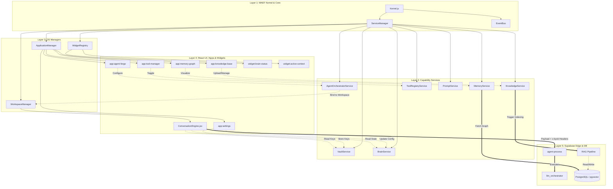

# MAEF v3 Ecosystem Dependency Map

**Mode:** Architecture Preservation
**Objective:** Memaetakan hierarki dependensi antara Kernel, Service Manager, UI Layer (React), dan Sistem Backend berdasarkan rancangan Reintegrasi Arsitektur.

## Diagram Dependensi (Mermaid)

## Penjelasan Alur Dependensi (Dependency Flow)

### 1. The Source of Truth (Layer 1)
- **Kernel.js** adalah otoritas tertinggi. React tidak boleh menginisialisasi layanan apa pun secara independen.
- Kernel me-register `ServiceManager` dan `EventBus` pada fase awal (Phase 1 & 2).

### 2. Abstraksi Layanan (Layer 2)
Layanan-layanan ini (seperti `BrainService`, `VaultService`) hidup di dalam memori OS (bukan di dalam React State). 
- Mereka memegang state murni (Data & Logika).
- Mereka berkomunikasi satu sama lain melalui `EventBus`.
- **Aturan Dependensi:** Service tidak boleh bergantung pada UI. UI yang bergantung pada Service.

### 3. Jembatan OS ke UI (Layer 3)
- `ApplicationManager`, `WorkspaceManager`, dan `WidgetRegistry` mengambil state dari Layanan dan mendikte apa yang boleh dirender oleh React.

### 4. Presentation Layer (Layer 4)
- Aplikasi seperti `app:settings` tidak menyimpan kuncinya sendiri. Saat Anda menekan "Save", React mengirim pesan ke `VaultService`.
- `ConversationEngine` tidak lagi menebak-nebak API Key, ia meminta `VaultService` dan `BrainService` untuk merakit *Header* HTTP sebelum mengirimnya ke Backend.

### 5. Pelaksanaan Fisik (Layer 5)
- Begitu *request* sampai ke `agent-process` (Edge Function), backend sudah menerima paket bersih (Model yang digunakan + Kunci API yang dienkripsi via header + Prompt).
- `llm_orchestrator` tinggal mengeksekusi sesuai arahan tanpa peduli bagaimana UI bekerja.

---
**Status Arsitektur:** Map ini menjadi fondasi yang mutlak sebelum kita menulis kode implementasi apa pun untuk kapabilitas yang hilang.
