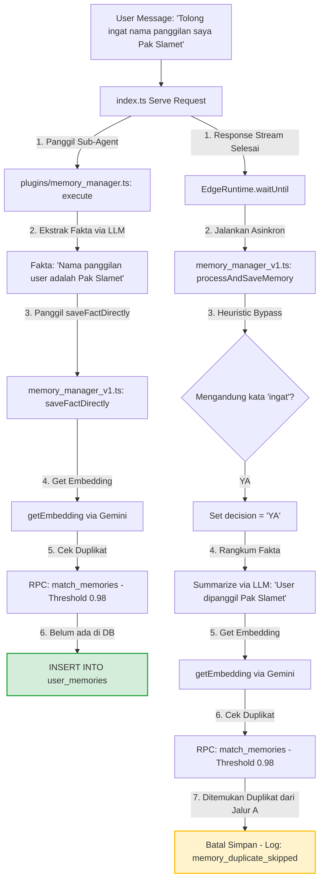

# Audit Menyeluruh Arsitektur Memory Manager

Audit ini dilakukan berdasarkan kode aktual yang ada di dalam repositori `mamet334/ai-agent-project` per tanggal **18 Juni 2026**.

---

## 1. Lokasi Penulisan (*Write*) ke `user_memories`
Penulisan ke tabel `user_memories` hanya dilakukan melalui panggilan insert di dalam file:
- **`supabase/functions/agent-process/plugins/memory_manager_v1.ts` (Baris 68 - 72)**
  *Di dalam fungsi `saveFactDirectly` (digunakan oleh sub-agent):*
  ```typescript
  const { error: insertError } = await supabase.from('user_memories').insert([{ 
    user_id: safeUserId, 
    summary: fact, 
    embedding: embedding 
  }]);
  ```
- **`supabase/functions/agent-process/plugins/memory_manager_v1.ts` (Baris 256 - 260)**
  *Di dalam fungsi `processAndSaveMemory` (digunakan oleh background saver):*
  ```typescript
  const { error: insertError } = await supabase.from('user_memories').insert([{ 
    user_id: safeUserId, 
    summary: summary, 
    embedding: embedding 
  }]);
  ```

---

## 2. Lokasi Pembacaan (*Read*) dari `user_memories`
Pembacaan data memori dilakukan di beberapa titik:
- **`supabase/functions/agent-process/plugins/memory_manager_v1.ts` (Baris 105 - 110)**
  *Membaca memori relevan saat chat menggunakan fungsi RPC `match_memories` (Threshold: 0.70):*
  ```typescript
  const { data, error } = await supabase.rpc('match_memories', {
    query_embedding: embedding,
    match_threshold: 0.70, 
    match_count: 5,        
    target_user_id: safeUserId
  });
  ```
- **`supabase/functions/agent-process/plugins/memory_manager_v1.ts` (Baris 50 - 55)**
  *Melakukan pengecekan duplikasi memori saat direct save (Threshold: 0.98):*
  ```typescript
  const { data: existingData, error: matchError } = await supabase.rpc('match_memories', {
    query_embedding: embedding, 
    match_threshold: 0.98, 
    match_count: 1, 
    target_user_id: safeUserId
  });
  ```
- **`supabase/functions/agent-process/plugins/memory_manager_v1.ts` (Baris 238 - 243)**
  *Melakukan pengecekan duplikasi memori saat background save (Threshold: 0.98):*
  ```typescript
  const { data: existingData, error: matchError } = await supabase.rpc('match_memories', {
    query_embedding: embedding, 
    match_threshold: 0.98, 
    match_count: 1, 
    target_user_id: safeUserId
  });
  ```
- **`supabase/functions/agent-process/index.ts` (Baris 140)**
  *Debug Endpoint GET `/agent-process` untuk menampilkan isi memori secara langsung:*
  ```typescript
  const { data: memData, error: memError } = await supClient.from('user_memories').select('*').order('created_at', { ascending: false }).limit(50);
  ```

---

## 3. Lokasi Pemanggilan `processAndSaveMemory`
Fungsi background saver ini dipanggil secara asinkron di akhir aliran respons (streaming) pada file:
- **`supabase/functions/agent-process/index.ts` (Baris 1136)**
  *Dipanggil setelah chat biasa (non-subagent) selesai di-stream:*
  ```typescript
  const memoryPromise1 = processAndSaveMemory(message, "[Chat Biasa - AI Respons Streamed]", userId, Deno.env.get('SUPABASE_URL') || '', Deno.env.get('SUPABASE_SERVICE_ROLE_KEY') || '', GEMINI_API_KEY, GROQ_API_KEY).catch(e => console.error(e));
  ```
- **`supabase/functions/agent-process/index.ts` (Baris 1281)**
  *Dipanggil setelah chat hasil sintesis sub-agent selesai di-stream:*
  ```typescript
  const memoryPromise2 = processAndSaveMemory(message, "[Sub-Agent Synthesis - AI Respons Streamed]", userId, Deno.env.get('SUPABASE_URL') || '', Deno.env.get('SUPABASE_SERVICE_ROLE_KEY') || '', GEMINI_API_KEY, GROQ_API_KEY).catch(e => console.error(e));
  ```

---

## 4. Lokasi Pemanggilan `saveFactDirectly`
Penyimpanan langsung tanpa re-klasifikasi dipanggil pada file:
- **`supabase/functions/agent-process/plugins/memory_manager.ts` (Baris 26)**
  *Dipanggil oleh sub-agent setelah berhasil mengekstrak fakta dari teks:*
  ```typescript
  await saveFactDirectly(extractedFact, userId, supabaseUrl, supabaseKey, geminiKey);
  ```

---

## 5. Lokasi Pemanggilan `memory_manager` Sub-Agent
Sub-agent ini dipanggil dan dikelola oleh sistem orkestrasi di file:
- **`supabase/functions/agent-process/plugins/registry.ts` (Baris 10 & 30)**
  *Registrasi modul sub-agent:*
  ```typescript
  import memoryManager from './memory_manager.ts'; // Baris 10
  // ...
  export const plugins = [
    // ...
    memoryManager, // Baris 30
  ];
  ```
- **`supabase/functions/agent-process/index.ts` (Baris 1235 - 1237)**
  *Traffic Light Router untuk menentukan model LLM yang digunakan:*
  ```typescript
  } else if (subagent === 'scraper' || subagent === 'memory_manager' || subagent === 'communicator' || subagent === 'youtube_analyst' || subagent === 'file_analyzer') {
     console.log(`🚥 Traffic Light: Sub-agent [${subagent}] dialihkan ke GROQ (Tugas Ringan)`);
     model = 'groq-llama-3.1';
  }
  ```
- **`supabase/functions/agent-process/index.ts` (Baris 1250)**
  *Tempat eksekusi utama plugin sub-agent:*
  ```typescript
  const result = await plugin.execute({ task: fullTask, cleanTask: task, accumulatedContext, env, runLLM: customRunLLM, userId });
  ```

---

## 6. Lokasi Pemanfaatan `memory_manager.ts` Legacy
Sudah **tidak ada** file legacy `memory_manager.ts` yang terbengkalai. File `plugins/memory_manager.ts` yang aktif saat ini telah sepenuhnya dimigrasikan untuk memanggil `saveFactDirectly` (bukan lagi mengirim fetch RAG ke `rag-process` lama).

---

## 7. Lokasi yang Memakai `rag-process` atau `documents` untuk Memori
- **`supabase/functions/rag-process/`**
  Edge Function ini adalah modul independen yang murni digunakan untuk **Knowledge Base** (unggah PDF/dokumen panjang oleh user). Modul ini menyimpan data ke tabel `documents` dan `document_chunks` via RPC `match_documents`.
- **`supabase/functions/agent-process/index.ts` (Baris 974 - 979)**
  Membaca referensi Knowledge Base (RAG) saat proses chat berlangsung menggunakan data dari `match_documents` (bukan memori obrolan personal).

---

## Diagram Alur Eksekusi Memori

Saat user mengetik `"Tolong ingat nama panggilan saya Pak Slamet"`, sistem akan memicu **dua jalur eksekusi paralel** (Sinkron via Sub-Agent dan Asinkron via Background Saver):



### Penjelasan Jalur Terpilih:
1. **Jalur A (Explicit Sub-Agent)** bekerja secara **sinkron** saat menyusun jawaban. Sub-agent mengekstrak fakta dan langsung menanamkannya ke database (`INSERT INTO user_memories`).
2. **Jalur B (Background Saver)** berjalan secara **asinkron** di latar belakang menggunakan `EdgeRuntime.waitUntil`. Jalur ini mendeteksi kata `"ingat"` lalu memproses data. Namun, karena Jalur A sudah selesai menyimpan data terlebih dahulu, Jalur B akan mendeteksi kemiripan vektor sebesar >98% saat melakukan pengecekan duplikasi (`match_memories`), sehingga proses dihentikan secara aman tanpa menulis duplikat data.
