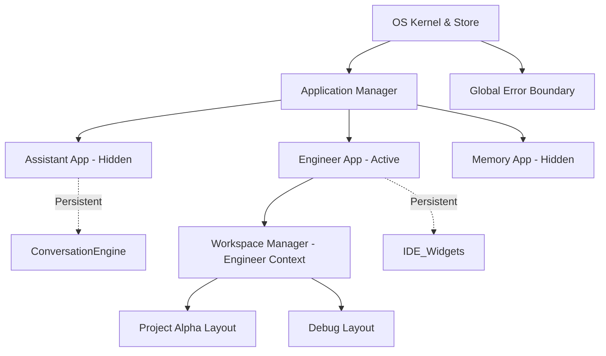

# MAMET ECOSYSTEM WORKSPACE ARCHITECTURE

**Status:** v1.0 - Active — **Dokumen Master/Otoritatif, Konsolidasi Penuh (2026-09-09)**
**Version:** 1.1.0
**Purpose:** Source of Truth for Mamet AI Operating System UI/UX Implementation

> [!IMPORTANT]
> **Cross-check kode (2026-09-09):** Dokumen ini dikonfirmasi sebagai spesifikasi yang benar-benar diimplementasikan — `frontend/src/core/workspaces/WorkspaceManager.js` docblock-nya secara eksplisit menulis *"Handles the lifecycle defined in 20_WORKSPACE_ARCHITECTURE.md"*. Field `left_workbench`/`right_workbench`/`bottom_workbench`, status siklus hidup (`IDLE`/`INITIALIZE`/`LOADING_MANIFEST`/`RESTORING_LAYOUT`/dst), dan terminologi "Workbench" (bukan "Dock") di `WorkbenchZone.jsx`/`WidgetHost.jsx`/`AppShell.jsx` semuanya cocok persis dengan dokumen ini.
>
> **Konsolidasi (2026-09-09):** Dokumen ini sebelumnya hidup berdampingan dengan dua proposal lain (`ARCHITECTURE-OS-NAVIGATION-V2.md` dan `ARCHITECTURE-UI-OS.md`) yang membahas visi serupa dengan istilah berbeda. Setelah cross-check kode, ketiganya digabung total ke satu file ini — bagian yang terbukti terimplementasi (hierarki Kernel→Application→Workspace dari `ARCHITECTURE-OS-NAVIGATION-V2.md`) diserap ke §2 di bawah; bagian yang tidak terpakai (istilah "Dock Zone" dari `ARCHITECTURE-UI-OS.md`) dicatat di §13 sebagai jejak evolusi desain. Kedua file sumber asli diarsipkan ke `docs/project-memory/history-archive/` (isi lengkap tetap bisa dibaca di sana).

---

## 1. ARCHITECTURE REVIEW & GAP ANALYSIS

### Review Kesalahan Masa Lalu
Pendekatan antarmuka Mamet AI saat ini masih terjebak pada mentalitas "Chatbot dengan Dashboard Tambahan". Hal ini terlihat dari `AIAgent.jsx` yang menggunakan *conditional rendering* kaku (`if/else`) untuk beralih antara fitur (Chat, Engineer, Monitoring) — pada satu titik file ini mencapai >3500 baris kode karena harus memuat semua *state* aplikasi.

Meskipun proposal sebelumnya mulai menyentuh konsep "Dock", namun proposal tersebut gagal memisahkan *UI rendering* dari *Business Logic*, dan gagal mengenali pentingnya **Workspace Identity** dan **Plugin Architecture**.

### Architecture Gap
1. **Workspace bukan sekadar Layout**: Saat ini "Workspace" hanya berarti perpindahan tampilan (View). Seharusnya Workspace adalah entitas yang mengikat Memori, Knowledge, Kapabilitas, dan Izin (Permissions).
2. **Chat diperlakukan sebagai Widget**: Chat saat ini disandingkan dengan komponen lain secara sejajar. Padahal, obrolan adalah *Conversation Engine* yang menjadi jantung/pusat interaksi di mana Widget lain bertugas membantunya.
3. **Hardcoded UI**: UI saat ini harus diedit secara manual setiap kali ada kapabilitas baru. Seharusnya menggunakan *Registry Pattern*.
4. **Tidak Ada State Persistence**: Layout hilang saat berpindah menu atau *refresh*.
5. **Sidebar Overload**: Setiap penambahan Capability baru membutuhkan tombol baru di *sidebar* — tidak dapat diskalakan ke puluhan/ratusan Workspace atau Capability.
6. **Context Mixing**: Konsep "Aplikasi" (apa yang sedang dilakukan Owner) tercampur dengan konsep "Workspace" (lingkungan data yang dipakai). `Engineer` adalah peran/aplikasi, sedangkan `Project Alpha` adalah ruang kerjanya — sebelumnya keduanya disejajarkan dalam satu hirarki navigasi datar.

---

## 2. HIERARKI SISTEM PENUH: DARI KERNEL SAMPAI WIDGET

Sebelum masuk ke detail Workspace (§3 dst), penting memahami di mana Workspace duduk di dalam hierarki runtime penuh. Konsep **App (Tool)** dipisahkan dari **Workspace (Environment)** — App menjawab "apa yang sedang Owner lakukan", Workspace menjawab "lingkungan data/konteks apa yang dipakai".

```text
MAMET OS (Shell)
│
├── 1. KERNEL (Global Runtime, Boot, Panic, Recovery)
│
├── 2. RUNTIME LAYER (Event Bus, Scheduler, Dependency Injection / ServiceManager)
│
├── 3. SERVICE MANAGER (AI Runtime, Memory, Auth, Storage)
│
├── 4. APPLICATION MANAGER (Register, Activate, Suspend, Destroy)
│
├── 5. WINDOW MANAGER (Split Screen, Floating, Docking Foundation)
│
├── 6. APPLICATION (Assistant, Engineer, Memory, Research)
│
├── 7. WORKSPACE (Environment / Project Context) — lihat §3 dst
│
├── 8. SESSION (Active State)
│
└── 9. CONVERSATION (Data/UI Payload)
```

**Status implementasi (dikonfirmasi via cross-check kode, 2026-09-09):** Level 1-6 sudah nyata di kode — `Kernel.js` (boot sequence 10 fase), `ApplicationManager.js` (state `REGISTERED`/`BACKGROUND`/`RUNNING`), `WindowManager.js`, divalidasi CERTIFIED/PASS di `ARCHITECTURE-VALIDATION-V2.md`/`ARCHITECTURE-ACCEPTANCE-TEST-V2.md`. Level 7-9 (Workspace/Session/Conversation) adalah fokus detail dokumen ini (§3 dst).

**Matrix Aplikasi & Workspace (contoh):**
- **Assistant App** → *Workspace*: Owner, Personal, Family
- **Engineer App** → *Workspace*: Project Alpha, Debug, Frontend Build
- **Memory App** → *Workspace*: Global DB, Local Files, Cloud
- **Research App** → *Workspace*: DeepMind Papers, AI Agents, Market Research

### Navigation Flow

1. **Global Sidebar**: Ikon statis mirip VS Code (kiri ekstrim) untuk berpindah Aplikasi — `[Chat] [Engineer] [Memory] [Research] [Settings]`. *(Catatan implementasi: konsep ini semula disebut "Activity Bar" di draft desain; komponen nyata di kode bernama `Sidebar.jsx`.)*
2. **Application Switch**: Klik ikon Global Sidebar *menyembunyikan* UI aplikasi lama (CSS `hidden`, bukan unmount) dan menampilkan UI aplikasi baru. **Tidak ada unmount** — lifecycle tetap hidup di latar belakang. Dikonfirmasi PASS di `ARCHITECTURE-ACCEPTANCE-TEST-V2.md` Test Scenario 3.1.
3. **Contextual Sidebar (Secondary)**: Saat berada di `Engineer App`, sidebar sekunder menampilkan daftar Workspace yang tersedia khusus untuk Engineering.
4. **Workspace Switch**: Mengubah Workspace di dalam sebuah Aplikasi hanya memuat konteks data/layout untuk aplikasi tersebut, tanpa mematikan Aplikasi itu sendiri.

### Diagram Hirarki (State Management)



---

## 3. REVISED UI ARCHITECTURE: PLUGIN-FIRST OS

Mamet UI direkayasa ulang menggunakan pola **Plugin-First Architecture**. Arsitektur ini melepaskan *Core UI* dari ketergantungan pada fitur-fitur spesifik. Aliran pembentukan layar (Rendering Flow) selalu bergerak dari *Data (Manifest)* menuju *View (UI)*, bukan sebaliknya:

```text
Workspace Request
       ↓
Manifest Loader
       ↓
Capability Registry (Load backend constraints)
       ↓
Widget Registry (Load frontend modules)
       ↓
Conversation Engine (Mount Anchor)
       ↓
Workbench System (Mount Panels)
       ↓
Rendered Workspace UI
```

---

## 4. WORKSPACE IDENTITY & MANIFEST

Setiap Workspace wajib memiliki identitas yang diisolasi. Workspace didefinisikan secara statis maupun dinamis melalui sebuah **Workspace Manifest**.

### Hierarki Workspace Session
Workspace tidak langsung memiliki riwayat obrolan. Struktur hierarki yang benar adalah:
```text
Workspace
    ↓
Workspace Session
    ↓
Conversation Engine
    ↓
Workbench
    ↓
Widgets
```
Satu Workspace dapat memiliki banyak Session. Chat/Percakapan dimiliki oleh Session, bukan secara langsung oleh Workspace. Hal ini memungkinkan Owner membuka beberapa sesi terpisah di dalam satu Workspace tanpa mencampur aduk riwayat.

### Struktur Manifest (`workspace.json` atau DB Record)
Sistem UI tidak boleh menebak konfigurasi. Core UI akan membaca manifest berikut saat me-*load* ruang kerja:
```json
{
  "id": "ws-engineer-01",
  "name": "Engineer Console",
  "description": "Ruang kerja terisolasi untuk rekayasa perangkat lunak Mamet",
  "context": {
    "memory_source": "PROJECT_MEMORY",
    "knowledge_source": "ENGINEERING_KNOWLEDGE"
  },
  "capabilities": [
    "cap:code-execution",
    "cap:architecture-verification",
    "cap:repository-access"
  ],
  "default_layout": {
    "left_workbench": ["widget:task-list", "widget:architecture-gaps"],
    "right_workbench": ["widget:verification-log"],
    "bottom_workbench": ["widget:system-terminal"]
  },
  "permissions": {
    "allow_global_memory": false,
    "allow_web_search": true
  }
}
```

---

## 5. REGISTRY ARCHITECTURE

Inti dari skalabilitas UI Mamet adalah Sistem Registri ganda (Frontend & Backend).

### A. Capability Registry (Backend / Logic Constraint)
UI tidak boleh menghardcode menu untuk kapabilitas. UI akan melakukan *query* ke Capability Registry: *"Apa yang bisa dilakukan di Workspace ini?"*. Jika Workspace memiliki kapabilitas `cap:repository-access`, UI secara dinamis mengizinkan *intent* terkait file system.

### B. Widget Registry (Frontend / UI Module)
Setiap Widget berdiri sendiri dengan *metadata* yang lengkap. Widget didaftarkan saat aplikasi dimulai:
```javascript
WidgetRegistry.register({
  id: 'widget:task-list',
  name: 'Engineering Tasks',
  icon: 'TargetIcon',
  version: '1.0.0',
  allowed_workspaces: ['ENGINEER', 'OWNER'],
  default_size: { width: 300, height: 400 },
  default_workbench: 'left',
  component: lazy(() => import('./widgets/TaskListWidget'))
});
```
Dengan ini, jika ada 100 kapabilitas dan 50 widget baru, *Core UI* tidak perlu disentuh sama sekali.

Sebagai gambaran skala target: kapabilitas baru cukup didaftarkan sebagai "App" ke Application Manager (§2) atau "Widget" ke Widget Registry ini, tanpa merusak struktur Workspace yang sudah ada.

---

## 6. CONVERSATION ENGINE (THE CORE ANCHOR)

**Konsep Kritis:** Chat BUKAN Widget.
Chat adalah **Conversation Engine**. Ia merupakan *Anchor* (Jangkar) yang bersemayam tepat di tengah layar dan tidak bisa ditutup, digeser, atau disembunyikan. Semua Widget di sekelilingnya bertugas untuk memberikan konteks, visualisasi, atau data kepada *Conversation Engine*.

### Lifecycle Observability di UI
Conversation Engine tidak hanya menampilkan pesan teks, tetapi merepresentasikan *State Machine* secara *real-time*:
1. **User** (Input Prompt)
2. **Intent** (UI menunjukkan "Memahami niat...")
3. **Planner** (UI menunjukkan "Menyusun strategi...")
4. **Capability** (UI menunjukkan "Mengeksekusi tool: Read File...")
5. **Verification** (UI menunjukkan "Memverifikasi arsitektur...")
6. **Synthesis** (UI menunjukkan "Merangkum hasil...")
7. **Response** (Pesan final ditampilkan di layar)

Setiap *node* dalam *lifecycle* ini dapat diklik oleh pengguna untuk melempar rincian *log* ke dalam **Right Workbench**. Saat pengguna mengklik referensi arsitektur di Chat, Widget terkait (misal Architecture Viewer) otomatis dimuat di Right Workbench — Inspector hanya muncul jika ada data kontekstual yang relevan.

---

## 7. WORKBENCH SYSTEM

Konsep "Dock" atau "Sidebar" diganti dengan konsep **Workbench** yang sangat modular dan kontekstual. *(Draft desain awal — lihat §13 — sempat mengusulkan istilah "Dock Zone"; istilah yang bertahan dan dipakai kode adalah "Workbench".)*

Sistem Workbench membungkus *Conversation Engine*:
* **Left Workbench**: Area statis/persisten (Navigasi, Daftar Workspace, Konteks Utama seperti Task).
* **Right Workbench (Inspector)**: Area responsif/kontekstual. Terbuka otomatis saat *Conversation Engine* membutuhkan visualisasi (Misal: melihat detail arsitektur, membaca diff kode).
* **Bottom Workbench**: Area observabilitas teknis (Terminal, System Events, Raw Logs).
* **Floating Workbench**: Area utilitas mandiri yang bisa digeser (Kalkulator cepat, Note kecil).

Setiap Workbench bertindak sebagai *Host* yang menampung *Widget* yang telah diregistrasi.

### Responsive Strategy
* **Desktop**: Sistem Multi-Panel (Kiri - Tengah - Kanan) beroperasi penuh.
* **Tablet**: Right Workbench otomatis tersembunyi sebagai *Flyout Menu* (panel yang meluncur keluar).
* **Mobile**: Sistem bertumpuk (*Stacked*) — Anchor (Chat) memenuhi layar, Widget diakses lewat *Bottom Sheet* atau menu *Off-canvas*.

---

## 8. WORKSPACE MANAGER & LIFECYCLE

**Workspace Manager** adalah konduktor utama UI. Proses pergantian ruang kerja di Mamet akan terasa seberat dan selengkap mengganti *Project* di IDE (seperti VSCode), bukan sekadar pindah tab di browser.

**Lifecycle Pergantian Workspace:**
Siklus hidup sebuah Workspace harus ketat agar implementasi konsisten:
1. **Initialize**: Persiapan awal sebelum memori dan komponen dimuat.
2. **Load Manifest**: Membaca definisi (kemampuan, widget default) dari `workspace.json` atau basis data.
3. **Load Memory**: Mengikat konteks memori khusus untuk Workspace ini.
4. **Load Knowledge**: Mengikat sumber pengetahuan (dokumen RAG) untuk Workspace.
5. **Load Capability**: Mengaktifkan modul-modul fungsi yang diizinkan oleh Registry.
6. **Restore Layout**: Mengembalikan posisi dan ukuran panel dari sesi sebelumnya.
7. **Restore Session**: Memuat riwayat dari *Conversation Engine* yang relevan.
8. **Ready**: *Workspace* siap menerima interaksi pengguna.
9. **Suspend**: Proses dijeda sementara saat berpindah *Workspace* (state disimpan di *background*).
10. **Resume**: Menghidupkan kembali *Workspace* dari status *Suspend*.
11. **Archive**: Sesi ditutup sepenuhnya secara permanen.

---

## 9. UI EVENT FLOW & MAEF INTEGRATION

Sistem UI harus berjalan selaras dengan *Mamet AI Execution Framework* (MAEF). UI dilarang keras memanggil kapabilitas secara langsung (bypass). Alur event interaksi adalah sebagai berikut:

```text
Conversation Engine (User Input)
       ↓
UI Event (Dispatched)
       ↓
Workspace Manager (Membungkus event dengan konteks Session & Workspace)
       ↓
Capability Registry (Mengecek izin)
       ↓
Capability Adapter (Menerjemahkan ke protokol MAEF)
       ↓
MAEF Orchestrator (Backend mengeksekusi siklus)
       ↓
Verification (Backend melakukan validasi integritas)
       ↓
Response (Kembali ke Conversation Engine & dirender)
```

---

## 10. RUNTIME STATE & LAYOUT PERSISTENCE

### Runtime State
Saat Workspace berada dalam fase **Ready**, Workspace Manager harus mempertahankan *state* berikut di dalam memori klien (React State / Store):
* **Active Session**: Sesi obrolan/kerja mana yang sedang berjalan.
* **Active Layout**: Konfigurasi tata letak visual saat ini.
* **Active Widgets**: Daftar widget yang sedang di-*render*.
* **Active Capability**: Izin alat yang sedang bisa digunakan.
* **Active Memory Context**: Filter *Memory* yang sedang di-*binding* ke sesi.
* **Active Knowledge Context**: Akses klaster RAG yang relevan.

### Layout Persistence
Layout bukanlah bagian statis dari UI, melainkan bagian dinamis dari Workspace. Setiap perubahan visual oleh pengguna akan disimpan ke dalam konfigurasi Workspace per *Session*. Data yang disimpan minimal mencakup:
* **Ukuran panel** (lebar/tinggi Workbench).
* **Posisi widget** (kiri, kanan, bawah, atau floating).
* **Widget aktif** (disembunyikan atau ditampilkan).
* **Workbench state** (terbuka/tertutup).
* **Sesi terakhir** yang diakses.
Layout ini akan di-*restore* secara otomatis saat pengguna kembali membuka Workspace tersebut. Database impact minimal — cukup tabel/kolom konfigurasi UI ringan (mis. `workspace_layouts`/`user_preferences`), tanpa migrasi skema utama.

---

## 11. IMPLEMENTATION ROADMAP

Eksekusi harus dilakukan secara bertahap untuk mencegah kegagalan sistem produksi yang ada:

### Phase 1: Core Registry & Workspace Manager
- Membangun `WorkspaceManager` class.
- Membangun `WidgetRegistry` dan format *Workspace Manifest*.
- *Tidak ada perubahan UI visual di fase ini.*

### Phase 2: Workbench Engine
- Membuat infrastruktur `LeftWorkbench`, `RightWorkbench`, dan `BottomWorkbench`.
- Membuat mekanisme *Drag, Drop, Resize* yang menyimpan state ke dalam *Workspace Manager*.

### Phase 3: Extraction & Refactoring
- Memecah komponen-komponen statis di `AIAgent.jsx` dan `EngineerDashboard.jsx` menjadi Widget mandiri.
- Mendaftarkan mereka ke dalam `WidgetRegistry`.

### Phase 4: Conversation Engine Upgrade
- Mengubah Chat dari sekadar penampil riwayat menjadi penampil siklus hidup (User -> Intent -> Planner -> ...).
- Mengintegrasikan interaksi antara *Conversation Engine* dan *Right Workbench* (Klik untuk detail).

### Phase 5: Production Rollout & Layout Persistence
- Mengaitkan penyimpanan Layout ke tabel *Supabase* milik *Owner*.
- *Deprecate* (matikan) hardcoded view logic yang lama.

**Status implementasi (2026-09-09):** Phase 1 (Registry & Workspace Manager) dan sebagian Phase 2/3 dikonfirmasi CERTIFIED/PASS oleh `ARCHITECTURE-VALIDATION-V2.md`/`ARCHITECTURE-ACCEPTANCE-TEST-V2.md` — Kernel boot lock, ApplicationManager, WindowManager, isolasi state antar-App semua PASS. Progres Phase 4-5 belum diverifikasi ulang di dokumen ini; rujuk kode terbaru untuk status pasti (Anti-Hallucination Protocol: jangan asumsikan selesai tanpa observasi runtime).

---

## 12. MIGRATION STRATEGY
* **Paralel UI**: Selama Fase 1 hingga Fase 4, UI lama (`AIAgent.jsx`) tetap berjalan sebagai *default*. Sistem UI OS yang baru (contoh: `OSDesktop.jsx`) dapat diakses melalui bendera fitur (Feature Flag) tersembunyi untuk uji coba *Owner*.
* **Seamless State Transfer**: Riwayat obrolan tidak terpengaruh, karena UI OS baru tetap membaca tabel `chats` berdasarkan filter `workspace_type` yang telah kita perkuat pada revisi sebelumnya.
* **Backward Compatibility**: `AIAgent.jsx` versi lama dapat dipertahankan dengan nama `LegacyAgent.jsx` (atau di-serve secara kondisional) untuk fallback darurat selama masa transisi.

---

## 13. SEJARAH & EVOLUSI DESAIN (Konsolidasi 2026-09-09)

Dokumen ini adalah hasil penggabungan tiga proposal yang sebelumnya terpisah dan tumpang tindih:

| Dokumen Asli | Kontribusi | Nasib |
|---|---|---|
| `20_WORKSPACE_ARCHITECTURE.md` (dokumen ini) | Desain Workspace/Manifest/Workbench/Registry lengkap — dirujuk langsung oleh `WorkspaceManager.js` | Tetap jadi dokumen master, isi tidak berubah kecuali penambahan §2 dan §13 ini |
| `ARCHITECTURE-OS-NAVIGATION-V2.md` | Hierarki Kernel→Application Manager→Window Manager→Workspace, pemisahan konsep App vs Workspace, `ApplicationManager`/`WindowManager` sebagai nama class asli | Diserap ke §2 di atas. File asli diarsipkan ke `docs/project-memory/history-archive/` |
| `ARCHITECTURE-UI-OS.md` | Diagnosis awal masalah UI (Mental Model Chat App, Sidebar Overload, dll), istilah "Dock Zone", Responsive Strategy | Diagnosis diserap ke §1; Responsive Strategy diserap ke §7; istilah "Dock Zone" **tidak dipakai** (kode pakai "Workbench"). File asli diarsipkan ke `docs/project-memory/history-archive/` |

**Alasan konsolidasi:** Sebelum digabung, ketiga dokumen menjelaskan visi yang secara substansi sama dengan istilah dan tingkat detail berbeda, tanpa saling merujuk — berisiko membingungkan Engineer/AI yang membaca salah satu tanpa tahu ada dua lainnya. Cross-check terhadap kode aktual (`WorkspaceManager.js`, `ApplicationManager.js`, `WindowManager.js`, `WorkbenchZone.jsx`, `WidgetHost.jsx`, `Sidebar.jsx`) dilakukan sebelum memutuskan bagian mana yang diserap sebagai kebenaran arsitektural, dan bagian mana yang murni jejak evolusi desain.

---
**STATUS:** v1.1.0 - Active, Konsolidasi Penuh. Dokumen tunggal untuk seluruh arsitektur Workspace/Application/Workbench Mamet OS.
