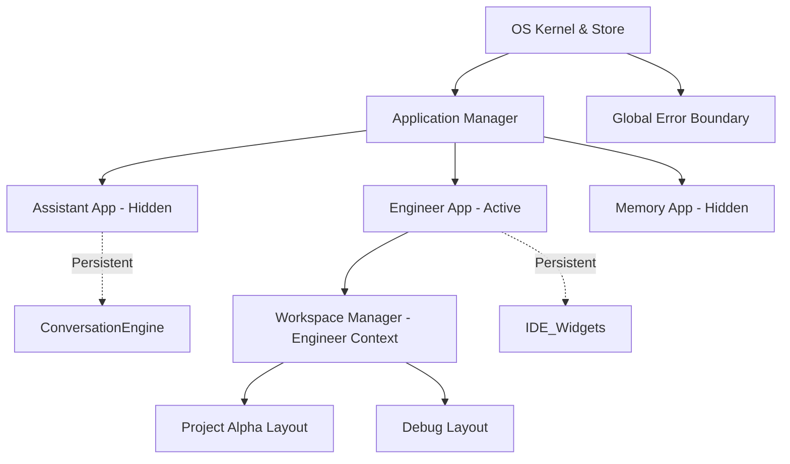

# MAMET OS: APPLICATION MANAGER ARCHITECTURE

**Status:** Proposed Design — **Sebagian Terserap ke Implementasi** (dikonfirmasi 2026-09-09)
**Version:** 2.0.0
**Target:** Transform Mamet OS from "Web Page Routing" to "Persistent Desktop Application"

> [!NOTE]
> **Cross-check kode (2026-09-09):** Konsep `ApplicationManager` dan `WindowManager` yang diusulkan di dokumen ini **memang menjadi nama class asli** di `frontend/src/core/application/ApplicationManager.js` dan `frontend/src/core/window/WindowManager.js` (state `REGISTERED`/`BACKGROUND`/`RUNNING` cocok persis, divalidasi `ARCHITECTURE-VALIDATION-V2.md`/`ARCHITECTURE-ACCEPTANCE-TEST-V2.md`, keduanya CERTIFIED/PASS). Namun untuk desain Workspace/Workbench/Manifest yang lebih detail dan benar-benar dirujuk kode, lihat `20_WORKSPACE_ARCHITECTURE.md` (dokumen master).

---

## 1. Audit Arsitektur Sekarang

Saat ini, navigasi Mamet OS berpusat pada **Workspace Manager** sebagai entitas tertinggi (Level 1).
- Saat pengguna memilih `Engineer Console` atau `Owner Workspace`, sistem mengganti keseluruhan *context* (`activeWorkspaceId`).
- Pergantian *workspace* memaksa siklus *teardown* (unmount) pada antarmuka saat ini dan *rebuild* (mount) untuk antarmuka baru.
- Antarmuka Chat (`ConversationEngine`) terikat di dalam tata letak (*layout*) dari *Workspace* tertentu.
- Tidak ada konsep **Aplikasi** (seperti IDE, Chat Client, atau Data Browser), yang ada hanyalah sekumpulan pengaturan letak UI (*layout preset*) bernama *Workspace*.

## 2. Kekurangan Desain Sekarang

1. **State Destruction**: Berpindah dari *Owner Workspace* ke *Engineer Console* akan mereset percakapan yang sedang berjalan atau widget yang sedang aktif. State tidak persisten di latar belakang.
2. **Context Mixing**: Konsep "Aplikasi" (Apa yang saya lakukan) tercampur dengan konsep "Workspace" (Lingkungan data apa yang saya gunakan). `Engineer` adalah peran/aplikasi, sedangkan `Project Alpha` adalah ruang kerjanya. Saat ini keduanya disejajarkan dalam satu hirarki navigasi.
3. **Website Feel**: Terasa seperti berpindah URL halaman web. Tidak terasa seperti sistem operasi lokal atau IDE seperti VS Code di mana Terminal, Explorer, dan Editor memiliki *lifecycle* independen.

---

## 3. Information Architecture Baru

Konsep desain baru memisahkan antara **App (Tool)** dan **Workspace (Environment)**.

### Hirarki Baru (Desktop OS Pattern)
```text
MAMET OS (Shell)
│
├── 1. KERNEL (Global Runtime, Boot, Panic, Recovery)
│
├── 2. RUNTIME LAYER (Event Bus, Scheduler, DI)
│
├── 3. SERVICE MANAGER (AI Runtime, Memory, Auth, Storage)
│
├── 4. APPLICATION MANAGER (Register, Activate, Suspend, Destroy)
│
├── 5. WINDOW MANAGER (Split Screen, Floating, Docking Foundation)
│
├── 6. APPLICATION (Assistant, Engineer, Memory, Research)
│
├── 7. WORKSPACE (Environment / Project Context)
│
├── 8. SESSION (Active State)
│
└── 9. CONVERSATION (Data/UI Payload)
```

**Matrix Aplikasi & Workspace:**
- **Assistant App** -> *Workspace*: Owner, Personal, Family
- **Engineer App** -> *Workspace*: Project Alpha, Debug, Frontend Build
- **Memory App** -> *Workspace*: Global DB, Local Files, Cloud
- **Research App** -> *Workspace*: DeepMind Papers, AI Agents, Market Research

---

## 4. Navigation Flow Baru

1. **Global Sidebar (Activity Bar)**: Mirip dengan VS Code (kiri ekstrim). Ikon statis: `[Chat] [Engineer] [Memory] [Research] [Settings]`.
2. **Application Switch**: Klik ikon di Global Sidebar akan *menyembunyikan* UI aplikasi lama (via CSS `display: none` atau teknik React komponen `hidden`) dan menampilkan UI aplikasi baru. **Tidak ada unmount**. *Lifecycle* tetap hidup.
3. **Contextual Sidebar (Secondary)**: Saat berada di `Engineer App`, *sidebar* sekunder menampilkan daftar *Workspace* yang tersedia khusus untuk *Engineering*.
4. **Workspace Switch**: Mengubah *Workspace* di dalam sebuah Aplikasi HANYA akan memuat konteks data/layout untuk aplikasi tersebut, tanpa mematikan Aplikasi itu sendiri.

---

## 5. Diagram Hirarki (State Management)



---

## 6. File yang Harus Diubah (Impact Analysis)

1. `frontend/src/App.jsx`: Harus direfaktor untuk me-*render* `ApplicationManager` alih-alih merender tunggal `WorkspaceShell`.
2. `frontend/src/core/workspace/WorkspaceManager.js`: Dipecah/diperluas agar mendukung *multi-instance* (satu instance per Aplikasi) atau diubah menjadi `ContextManager` spesifik.
3. `frontend/src/components/workbench/WorkspaceShell.jsx`: Akan diturunkan pangkatnya menjadi `AppShell`, merender isi spesifik dari suatu Aplikasi.
4. **[NEW]** `frontend/src/core/application/ApplicationManager.js`: *Controller* baru untuk menjaga *state* Aplikasi yang hidup di latar belakang.
5. **[NEW]** `frontend/src/components/layout/ActivityBar.jsx`: Global Sidebar (Level 1) untuk berpindah Aplikasi.
6. `frontend/src/components/widgets/WorkspaceNavWidget.jsx`: Akan dibongkar dan diubah menjadi *Contextual Explorer* untuk *Workspace* sekunder di dalam masing-masing Aplikasi.

---

## 7. Migration Plan (Eksekusi Bertahap)

Untuk mencegah kerusakan sistem (sesuai *Engineering Evolution* MAEF), migrasi dilakukan dalam 3 Fase:

* **Phase 1: Shell Restructuring (UI Scaffold)**
  - Bangun `ActivityBar` (Global Sidebar).
  - Bangun `ApplicationContainer` (UI Shell).
  - Membungkus OS tanpa mengubah perilaku/state *engine* lama.

* **Phase 2: State Persistence (App Manager Core)**
  - Bangun `ApplicationManager.js`.
  - Implementasi siklus hidup: *Registered -> Loading -> Running -> Background -> Suspended*.
  - Pemisahan *Global State* -> *App State* -> *Workspace State*.

* **Phase 3: Contextual Workspaces**
  - Isolasi Konteks: Setiap Aplikasi mendapatkan *Workspace Manager* sendiri.

* **Phase 4: Runtime Layer & Service Manager**
  - Pemisahan *dependency injection* dan *event bus* dari *Application Manager*.

* **Phase 5: Window Manager Foundation**
  - Kesiapan tata letak antarmuka agar di masa depan mendukung *Split Screen*, *Floating Window*, dan *Multiple Docking*.

---

## 8. Alasan Mengapa Desain Baru Sesuai dengan Visi Mamet OS

- **True Desktop Experience**: Dengan memisahkan Aplikasi dari *Environment*, OS terasa memiliki memori yang permanen. Pengguna bisa menganalisis log di *Engineer*, lalu beralih ke *Assistant* untuk bertanya, lalu kembali ke *Engineer* dengan keadaan yang masih persis sama (log tidak tertutup, *scroll* tidak hilang).
- **Separation of Concerns**: *Widget Registry* kini bisa difilter berdasarkan "Aplikasi", bukan sekadar "Workspace". Terminal IDE hanya relevan untuk *Engineer*, bukan *Assistant*.
- **Scalability**: Jika Mamet OS ke depannya membutuhkan fungsi baru (misal: *Financial Calculator / AirKas*), kita cukup menambahkannya sebagai "App" ke `ApplicationManager` tanpa harus merusak struktur *Workspace* yang sudah ada. Arsitekturnya mengadopsi standar emas IDE modern.
