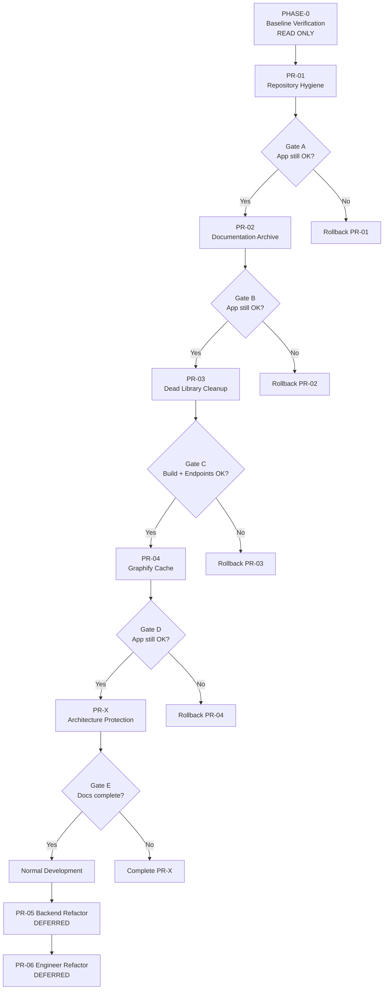

# Staged Cleanup Execution Plan (Revised)
> Berdasarkan: `docs/verification_report.md`
> Tanggal revisi: 2026-08-06
> Status: PLAN ONLY — tidak ada file yang diubah
> Filosofi: **Stability First. Architecture Preservation. Small Incremental Changes.**

---

## Guiding Principles

Seluruh proses cleanup ini dijalankan berdasarkan prinsip-prinsip berikut:

| Prinsip | Penerapan |
|---------|-----------|
| **Stability over Cleanliness** | Jika ada keraguan antara stabilitas dan kebersihan kode, pilih stabilitas. Tidak ada cleanup yang lebih penting dari sistem yang berjalan. |
| **Preserve History** | Dokumen sejarah memiliki nilai jangka panjang. Arsipkan, jangan langsung hapus. Gunakan folder `_knowledge_archive/` untuk preservasi. |
| **Evidence Before Deletion** | Tidak ada file yang dihapus tanpa bukti teknis yang terverifikasi: zero code refs, zero build deps, zero runtime deps. |
| **Small PRs** | Satu PR = satu concern. Tidak ada PR yang menggabungkan cleanup + refactor secara bersamaan. |
| **Easy Rollback** | Setiap PR harus bisa di-revert dalam satu command. Jika tidak bisa, PR tersebut terlalu besar. |
| **Build Verification After Every Stage** | Setiap PR yang menyentuh kode (bukan hanya docs) wajib diikuti build verification sebelum PR berikutnya dimulai. |
| **No Large Refactor During Cleanup** | Cleanup (hapus dead code) dan refactor (reorganisasi kode aktif) adalah dua pekerjaan berbeda. Tidak dilakukan bersamaan. |

---

## Ringkasan Kategorisasi

Data berikut berasal dari `verification_report.md` dan tidak diubah.

| Kategori | Jumlah Item | Estimasi Baris | Estimasi Size |
|----------|-------------|----------------|---------------|
| SAFE_BATCH_1 | 14 file | ~1,098 baris | < 1 MB |
| SAFE_BATCH_2 | 12 modul/file | ~47,860 baris | ~3 MB |
| ARCHIVE_CLEANUP | 2 folder besar | ~ribuan file | ~30 MB |
| REFACTOR | 2 file God-object | ~3,471 baris | ~142 KB |
| MANUAL_REVIEW | 7 item | — | — |

---

## Kategori Detail

### SAFE_BATCH_1 — Nol Risiko Runtime (Dibagi: Hapus vs Arsipkan)

File-file ini: (a) bukan kode yang dieksekusi, (b) tidak di-import/require oleh siapapun, (c) tidak masuk build pipeline, (d) bukan konfigurasi aktif.

**Kebijakan:** Sesuai prinsip *Preserve History*, file yang memiliki nilai dokumentasi sejarah project — meski tidak dipakai runtime — **dipindahkan ke `_knowledge_archive/`**, bukan dihapus langsung.

#### Sub-kategori: HAPUS (zero runtime dan zero historical value)

| File | Alasan | Bukti Teknis |
|------|--------|--------------|
| `.tmp_search_agent.ps1` | Script temp, prefix `.tmp` menunjukkan file sementara | Tidak ada CI/script yang memanggilnya; dibuat saat debug session |
| `mamet_fs` | File 0 byte, tidak ada isi, tidak ada tujuan | `(Get-Item).Length = 0`; tidak direferensikan di mana pun |
| `Acceptance Test Suite Phase 2-5.txt` | Duplikat subset dari versi `.md` | Konten identik dan lebih lengkap di versi `.md` |
| `docs/project-memory/change-log/2026-7-04.md` | Duplikat typo — versi benar sudah ada | `2026-07-04.md` (format benar) sudah ada di direktori yang sama |
| `docs/roadmap/raodmap memory governor.md` | Typo nama, zero referensi eksternal | Satu-satunya referensi luar adalah laporan audit ini sendiri |
| `frontend/vite.config.js.timestamp-*.mjs` | Cache Vite stale dengan path project lama | Referensi hardcoded ke `ai-agent-project`; di-regenerate otomatis saat `vite dev` |
| `ChatGPT Image 23 Jun 2026, 19.05.44.png` | Aset gambar tanpa referensi di kode manapun | Hanya muncul di `_DEAD_CODE_ARCHIVE_LIST.md` dan graphify snapshots |

#### Sub-kategori: ARSIPKAN ke `_knowledge_archive/` (zero runtime value, ada historical value)

| File | Alasan Arsip, Bukan Hapus | Bukti Teknis |
|------|---------------------------|--------------|
| `TODO.md` | Berisi niat dan rencana project yang pernah ada — berguna sebagai historical context | Zero code refs; 18 baris; tidak ada CI yang memanggilnya |
| `Runtime Pipeline Audit.txt` | Output audit dari sesi debugging yang mencatat kondisi pipeline — referensi diagnostik historis | Zero code refs; 73 baris; bukan kode aktif |
| `_DEAD_CODE_ARCHIVE_LIST.md` | Dokumen inventaris dead code yang sudah diidentifikasi — catatan sejarah keputusan teknis | Zero code refs; 521 baris; tidak di-require |
| `_check_archived_deps.js` | Script yang mendokumentasikan logika pengecekan dependency — referensi untuk audit serupa di masa depan | Root `package.json` tidak punya `scripts`; zero runtime refs |
| `Acceptance Test Suite Phase 2-5.md` | Dokumen test scenario yang pernah direncanakan — nilai referensi untuk test suite masa depan | Zero code refs; bukan konfigurasi aktif |
| `mametlite/mantra mametlite.txt` | Narasi sejarah lahirnya Mamet Lite — historical context project | Zero code refs; lihat PR-02 |

#### Sub-kategori: EDIT konfigurasi

| File | Perubahan | Alasan |
|------|-----------|--------|
| `frontend/.gitignore` | Tambahkan baris `dist/` | Saat ini hanya berisi `.vercel`; `dist/` tidak ter-ignore padahal merupakan build output, bukan source code |

---

### SAFE_BATCH_2 — Aman, Tapi Wajib Build Verification

File-file ini adalah dead code yang sudah dikonfirmasi, tapi ada sistem TypeScript yang aktif (`api/memory/`) yang bergantung pada sebagian dari `lib/`. Perlu build check setelah penghapusan.

| File | Alasan | Bukti Teknis |
|------|--------|--------------|
| `lib/behaviorMemoryEngine.ts` | Zero code refs | ZERO_CODE_REFS di 469 file non-node_modules |
| `lib/cognitiveMemoryGovernor.ts` | Zero code refs | Sama |
| `lib/contextUnifier.ts` | Zero code refs | Sama |
| `lib/globalCognitionLoop.ts` | Hanya import internal lib (dead island) | Tidak ada yang import dari luar `lib/` |
| `lib/intentPreprocessor.ts` | Zero code refs | Sama |
| `lib/memoryStabilityCore.ts` | Zero code refs | Sama |
| `lib/semanticBridge.ts` | Zero code refs | Sama |
| `lib/shortTermMemory.ts` | Zero code refs | Sama |
| `lib/singleCognitiveCore.ts` | Zero code refs | Sama |
| `lib/truthGraphMemory.ts` | Zero code refs | Sama |
| `lib/unifiedCognition.ts` | Zero code refs | Sama |
| `frontend/frontend_tree.md` | Dump tree 46K baris, tidak ada code reference | Hanya di archiv/graphify snapshots |

> [!NOTE]
> File `lib/` yang **TETAP ADA** (aktif digunakan):
> `memoryEngine.ts`, `truthScorer.ts`, `truthScoringEngine.ts`, `supabaseClient.ts`, `memoryGovernor.ts`, `ocb.ts`, `decisionEngine.ts`

---

### ARCHIVE_CLEANUP — Folder Besar (Evaluasi Per-Subfolder)

Kebijakan: **pertahankan minimal snapshot pertama dan snapshot terbaru** sebagai bukti historical evolution arsitektur.

| Folder | Size | Keputusan |
|--------|------|-----------|
| `graphify-out/2026-07-29/` | 5,349 KB | **PERTAHANKAN** — snapshot pertama, referensi baseline |
| `graphify-out/2026-07-30/` | 5,367 KB | Hapus — snapshot intermediate |
| `graphify-out/2026-07-31/` | 2,075 KB | Hapus — snapshot intermediate |
| `graphify-out/2026-08-04/` | 2,148 KB | Hapus — snapshot intermediate |
| `graphify-out/cache/` | 2,497 KB (319 files) | Hapus — AST cache, di-regenerate otomatis |
| `graphify-out/2026-08-05/` | 2,148 KB | **PERTAHANKAN** — snapshot terbaru |
| `graphify-out/` root files | 3,766 KB | **PERTAHANKAN** — report aktif (graph.html, graph.json, dll) |
| `_knowledge_archive/scratch/` | 2,687 KB (174 files) | Hapus — one-off scripts dan test outputs |
| `_knowledge_archive/changelog/` | 197 KB (42 files) | MANUAL_REVIEW — historis, bisa berharga |
| `_knowledge_archive/` root files | ~3,966 KB | MANUAL_REVIEW — mix (ada dokumen penting) |

**Alasan mempertahankan dua snapshot graphify:**
Dua titik waktu (pertama dan terbaru) memungkinkan perbandingan evolusi dependency graph arsitektur dari Juli hingga Agustus 2026. Ini adalah bukti perjalanan refactor yang tidak bisa di-regenerate ulang dengan nilai historis yang sama.

---

### REFACTOR — Bukan Dead Code, Hanya Simplifikasi (DEFERRED)

| File | Masalah | Status |
|------|---------|--------|
| `backend/server.js` (1,528 baris) | `runSandbox()` didefinisikan 2x identik; ~50% volume adalah telemetry boilerplate berulang | **DEFERRED** — lihat PR-05 |
| `frontend/src/core/runtime/services/engineer.js` (2,213 baris) | God-object: brain, session, task, verification, approval dalam satu file | **DEFERRED** — lihat PR-06 |

---

### MANUAL_REVIEW — Keputusan Manusia Diperlukan

| Item | Pertanyaan |
|------|-----------| 
| `node-fetch` di root `package.json` | Untuk apa root `package.json` ini ada? Tidak ada `scripts`. Apakah ini workspace root dari monorepo yang belum selesai dikonfigurasi? |
| `.github/workflows/production-pipeline.yml` | Deploy step di-comment — apakah workflow ini masih aktif di GitHub? Apakah security scan-nya masih relevan? |
| `backend/tools-config.js` | Didokumentasikan di ARCHITECTURE.md dan QUICK-START.md, tapi tidak di-require. Apakah masih ada rencana untuk mengintegrasikannya? |
| `frontend/.githubworkflows/build.yml` | **File BERBEDA** dari `.github/workflows/build.yml` (MD5 tidak sama). Perlu review: mana yang benar? |
| `docs/project-memory/MAEF V2.md` | Masih dikutip oleh 7 dokumen aktif sebagai referensi historis. Hapus atau arsipkan ke `_knowledge_archive/`? |
| `docs/project-memory/MAMET AI VISION DOCUMENT.md` | Masih dikutip oleh 5 dokumen aktif. Hapus atau arsipkan? |
| `docs/architecture/ARCHITECTURE-AUDIT-POST-5-2G-1.md` | Versi draft (3,442 B) vs FINAL (4,801 B). Apakah draft masih dibutuhkan untuk historical trace? |

---

---

## Urutan Eksekusi

```
PHASE-0 (Baseline Verification — READ ONLY)
    ↓
PR-01 (Repository Hygiene)
    ↓
Verification Gate A
    ↓
PR-02 (Documentation Archive)
    ↓
Verification Gate B
    ↓
PR-03 (Dead Library Cleanup)
    ↓
Verification Gate C  ← wajib build verification
    ↓
PR-04 (Graphify Cache Cleanup)
    ↓
Verification Gate D
    ↓
PR-X  (Architecture Protection)
    ↓
Verification Gate E
    ↓
Normal Development
    ↓
PR-05 (Backend Refactor — DEFERRED)
    ↓
PR-06 (Engineer Refactor — DEFERRED)
```

> [!IMPORTANT]
> Setiap Verification Gate adalah **hard stop**. Tidak ada PR berikutnya yang dimulai jika gate tidak hijau seluruhnya.



---

## PHASE-0 — Baseline Verification
> **READ ONLY** — Fase ini tidak mengubah satu file pun
> **Output:** `docs/BASELINE_VERIFICATION.md`

Tujuan: mendapatkan snapshot kondisi sistem sebelum cleanup dimulai. Dokumen ini menjadi referensi perbandingan di setiap Verification Gate.

### Checklist PHASE-0

```bash
# 1. Git State
git status                        # harus: "nothing to commit, working tree clean"
git branch                        # catat nama branch aktif
git rev-parse HEAD                # catat commit hash → simpan sebagai BASELINE_COMMIT

# 2. Frontend Build
cd frontend
npm run build
# Indikator sukses: "built in X.Xs" tanpa error

# 3. Backend Startup
cd backend
node server.js &
# Tunggu 3 detik lalu:
curl http://localhost:3000/api/health
# Indikator sukses: {"status":"OK"} atau 200 response

# 4. Dashboard Verification
# Buka http://localhost:5173 di browser
# Indikator sukses: UI muncul tanpa console error merah

# 5. Engineer Initialization
# Di UI: kirim pesan sederhana ke AI
# Indikator sukses: AI merespons dalam < 30 detik

# 6. Memory Verification
curl http://localhost:3000/api/memory
# Indikator sukses: response JSON tanpa 500 error

# 7. RAG Verification (jika Supabase tersedia)
# Cek koneksi ke Supabase dari backend logs
# Indikator sukses: tidak ada "SUPABASE_CONNECTION_ERROR" di log

# 8. Catat semua hasil ke docs/BASELINE_VERIFICATION.md
```

### Template `docs/BASELINE_VERIFICATION.md`

```markdown
# Baseline Verification
Date: [TANGGAL]
Branch: [BRANCH]
Commit: [HASH]

## Results
| Check | Status | Notes |
|-------|--------|-------|
| git status clean | ✅/❌ | |
| frontend build | ✅/❌ | Build time: Xs |
| backend startup | ✅/❌ | |
| health endpoint | ✅/❌ | Response: |
| dashboard UI | ✅/❌ | |
| engineer init | ✅/❌ | |
| memory endpoint | ✅/❌ | |
| RAG connection | ✅/❌ | |

## Baseline Commit
[FULL COMMIT HASH untuk rollback]
```

> [!IMPORTANT]
> Jangan lanjutkan ke PR-01 jika ada satu pun check di PHASE-0 yang ❌. Perbaiki dulu sebelum memulai cleanup.

---

## PR-01 — Repository Hygiene
> **Risiko: NIHIL** | Tidak menyentuh satu baris kode pun

**Daftar File (hapus — zero runtime dan zero historical value):**
```
.tmp_search_agent.ps1
mamet_fs
Acceptance Test Suite Phase 2-5.txt
docs/project-memory/change-log/2026-7-04.md
docs/roadmap/raodmap memory governor.md
ChatGPT Image 23 Jun 2026, 19.05.44.png
frontend/vite.config.js.timestamp-1780590186875-b4762ee3b86758.mjs
```

**Daftar File (arsipkan ke `_knowledge_archive/` — ada historical value):**
```
TODO.md                          →  _knowledge_archive/TODO-2026-08.md
Runtime Pipeline Audit.txt       →  _knowledge_archive/Runtime-Pipeline-Audit-2026.txt
_DEAD_CODE_ARCHIVE_LIST.md       →  _knowledge_archive/DEAD_CODE_ARCHIVE_LIST.md
_check_archived_deps.js          →  _knowledge_archive/scripts/check_archived_deps.js
Acceptance Test Suite Phase 2-5.md →  _knowledge_archive/Acceptance-Test-Suite-Phase-2-5.md
```

**Daftar File (edit konfigurasi):**
```
frontend/.gitignore   → tambahkan baris: dist/
```

**Alasan pemisahan hapus vs arsip:**
File `.tmp_search_agent.ps1` dan `mamet_fs` adalah sampah murni (temp file dan 0-byte file). File `TODO.md`, audit output, dan script checker mengandung konteks historis keputusan teknis yang tidak dapat direkonstruksi — dipindahkan ke `_knowledge_archive/` mengikuti prinsip *Preserve History*.

| Atribut | Detail |
|---------|--------|
| **Alasan** | File temp/sampah dihapus; file dengan historical value diarsipkan ke `_knowledge_archive/` |
| **Bukti teknis** | Zero code refs di 469 file; `mamet_fs` = 0 bytes; `package.json` tidak punya `scripts` |
| **Estimasi risiko** | 🟢 NIHIL — zero runtime impact |
| **Estimasi perubahan** | -7 file dihapus, -5 file dipindahkan (bukan hilang dari repo), +1 baris di `.gitignore` |
| **Build commands** | Tidak diperlukan |
| **Test commands** | Tidak diperlukan |
| **Indikator sukses** | `git status` bersih setelah commit; semua file archive ada di `_knowledge_archive/`; `npm run dev` frontend masih jalan |
| **Risiko** | Tidak ada |
| **Rollback** | `git revert <commit-hash>` — semua file tersimpan di Git history |

---

## Verification Gate A (setelah PR-01)

Gate ini memvalidasi bahwa penghapusan file temp dan pemindahan ke archive tidak menimbulkan efek samping apapun.

```bash
# 1. Konfirmasi seluruh file archive ada di tempat tujuan
ls _knowledge_archive/TODO-2026-08.md
ls _knowledge_archive/DEAD_CODE_ARCHIVE_LIST.md
ls _knowledge_archive/scripts/check_archived_deps.js

# 2. Pastikan frontend masih bisa dev
cd frontend && npm run dev
# Tunggu build selesai → tidak ada error

# 3. Pastikan backend masih bisa start
cd backend && node server.js &
curl http://localhost:3000/api/health
# Indikator: 200 response

# 4. Bandingkan dengan BASELINE_VERIFICATION.md
# Jika semua sama → lanjut ke PR-02
# Jika ada perbedaan → investigasi sebelum lanjut
```

---

## PR-02 — Documentation Archive
> **Risiko: NIHIL** | Dokumen teks tanpa code reference

**Prinsip PR ini:**
Historical documents **dipindahkan ke folder archive** bila memungkinkan. Penghapusan hanya untuk file yang benar-benar tidak bernilai (typo duplikat, file 0 byte).

**Daftar File (hapus — tidak bernilai):**
```
docs/project-memory/change-log/2026-7-04.md  (duplikat typo, 2026-07-04.md sudah ada)
docs/roadmap/raodmap memory governor.md      (typo nama, zero referensi luar)
```

**Daftar File (pindahkan ke archive — preserve history):**
```
mametlite/mantra mametlite.txt  →  _knowledge_archive/mantra mametlite.txt
```

| Atribut | Detail |
|---------|--------|
| **Alasan** | Typo filename duplikat tidak bernilai. Namun narasi lore (`mantra mametlite.txt`) memiliki nilai sejarah proyek — dipindahkan, bukan dihapus. |
| **Bukti teknis** | `2026-7-04.md`: duplikat dari `2026-07-04.md`. `raodmap`: zero external refs. `mantra mametlite.txt`: zero code refs. |
| **Estimasi risiko** | 🟢 NIHIL — pure markdown/text files |
| **Estimasi perubahan** | -2 file dihapus, 1 file dipindahkan |
| **Build commands** | Tidak diperlukan |
| **Test commands** | Tidak diperlukan |
| **Indikator sukses** | `git diff --stat` menunjukkan perubahan file yang sesuai; tidak ada error di frontend/backend |
| **Risiko** | Tidak ada |
| **Rollback** | `git revert <commit-hash>` |

---

## Verification Gate (setelah PR-01 dan PR-02)

Jalankan ulang seluruh checklist dari PHASE-0. Bandingkan hasilnya dengan `docs/BASELINE_VERIFICATION.md`.

```bash
# Quick verification
cd frontend && npm run build
curl http://localhost:3000/api/health
# Jika keduanya OK → lanjut ke PR-03
# Jika ada yang gagal → rollback PR-02 atau PR-01 terlebih dahulu
```

---

## PR-03 — Dead Library Cleanup
> **Risiko: RENDAH** | Dead code TypeScript dengan sibling aktif di `lib/`

### Prasyarat Wajib (sebelum eksekusi)

```bash
# 1. Working tree HARUS bersih
git status
# Output harus: "nothing to commit, working tree clean"

# 2. Buat safety anchor — PILIH SALAH SATU:
# Opsi A: backup branch
git checkout -b backup/dead-lib-$(date +%Y%m%d)
git checkout -   # kembali ke branch semula

# Opsi B: git tag
git tag cleanup-before-dead-lib

# 3. Konfirmasi Verification Gate sebelumnya sudah hijau
```

**Daftar File (hapus):**
```
lib/behaviorMemoryEngine.ts
lib/cognitiveMemoryGovernor.ts
lib/contextUnifier.ts
lib/globalCognitionLoop.ts
lib/intentPreprocessor.ts
lib/memoryStabilityCore.ts
lib/semanticBridge.ts
lib/shortTermMemory.ts
lib/singleCognitiveCore.ts
lib/truthGraphMemory.ts
lib/unifiedCognition.ts
frontend/frontend_tree.md
```

**Alasan per file:**
- Ke-11 modul `lib/` = **ZERO_CODE_REFS** di seluruh 469 file kode sumber (terverifikasi di `verification_report.md`)
- Referensi yang ada hanya di: `_DEAD_CODE_ARCHIVE_LIST.md` (sudah dihapus di PR-01), dokumen audit, dan graphify snapshots — bukan kode aktif
- `supabase/functions/` mengimport dari `supabase/functions/agent-process/lib/` (lib lokal sendiri), **bukan** root `lib/`
- `frontend_tree.md` = 46K baris file dump, zero code references

**File `lib/` yang TIDAK dihapus (aktif digunakan):**
```
lib/memoryEngine.ts          ← diimport oleh api/memory/
lib/truthScorer.ts           ← diimport oleh memoryEngine.ts
lib/truthScoringEngine.ts    ← diimport oleh memoryEngine.ts
lib/supabaseClient.ts        ← diimport oleh memoryEngine.ts
lib/memoryGovernor.ts        ← diimport oleh decisionEngine.ts
lib/ocb.ts                   ← diimport oleh decisionEngine.ts
lib/decisionEngine.ts        ← diimport oleh globalCognitionLoop.ts
```

| Atribut | Detail |
|---------|--------|
| **Alasan** | Dead code TypeScript terkonfirmasi, memperbesar noise di repo tanpa nilai fungsional |
| **Bukti teknis** | ZERO_CODE_REFS di seluruh 469 file kode; tidak ada tsconfig; supabase tidak import dari root lib/ |
| **Estimasi risiko** | 🟡 RENDAH — dead code terkonfirmasi, tapi ada sibling aktif |
| **Estimasi perubahan** | -12 file, -47,860 baris |
| **Build commands** | `cd frontend && npm run build` |
| **Test commands** | `curl http://localhost:3000/api/memory` → harus masih respond JSON |
| **Indikator sukses** | (1) Frontend build tanpa error; (2) `node backend/server.js` start tanpa crash; (3) `GET /api/health` return 200 |
| **Risiko** | Jika ada dynamic require tersembunyi yang tidak terdeteksi, runtime akan crash saat feature tersebut diakses |
| **Rollback** | `git revert <commit-hash>` ATAU `git checkout backup/dead-lib -- lib/` |

---

## Verification Gate (setelah PR-03)

```bash
# Build check wajib
cd frontend && npm run build

# Backend startup check
cd backend && node server.js &
curl http://localhost:3000/api/health

# Memory endpoint check
curl http://localhost:3000/api/memory

# Jika semua OK → lanjut ke PR-04
```

---

## PR-04 — Graphify Cache Cleanup
> **Risiko: RENDAH** | Output tools, bukan source code

**Kebijakan snapshots:**
Pertahankan **snapshot pertama (2026-07-29)** dan **snapshot terbaru (2026-08-05)** sebagai historical baseline dan current state. Hapus snapshot intermediate dan cache.

**Alasan dua snapshot dipertahankan:**
Dua titik waktu memungkinkan perbandingan dependency graph sebelum dan sesudah major refactor wave 5. Ini adalah bukti evolusi arsitektur yang tidak bisa di-regenerate ulang secara retrospektif.

**Daftar File/Folder (hapus — hanya cache dan intermediate snapshot):**
```
graphify-out/2026-07-30/    (5,367 KB — intermediate snapshot)
graphify-out/2026-07-31/    (2,075 KB — intermediate snapshot)
graphify-out/2026-08-04/    (2,148 KB — intermediate snapshot)
graphify-out/cache/         (2,497 KB — AST cache, di-regenerate otomatis oleh graphify tool)
```

**Yang DIPERTAHANKAN:**
```
graphify-out/2026-07-29/    ← snapshot pertama (historical baseline — WAJIB)
graphify-out/2026-08-05/    ← snapshot terbaru (current state — WAJIB)
graphify-out/ (root files)  ← report aktif (graph.html, graph.json, dll)
_knowledge_archive/         ← seluruh folder dipertahankan (termasuk scratch/)
```

> [!IMPORTANT]
> **`_knowledge_archive/scratch/` DIPINDAHKAN dari PR-04 ke MANUAL_REVIEW.**
> Folder ini berisi 174 file (2.6 MB) yang mencakup SQL migration scripts, test phase files, audit outputs, dan utility scripts yang pernah digunakan. Menghapus 174 file sekaligus tanpa review per-item melanggar prinsip *Evidence Before Deletion*. Setiap file harus dievaluasi individual sebelum diputuskan hapus atau arsip.

| Atribut | Detail |
|---------|--------|
| **Alasan** | Graphify intermediate snapshots adalah output tools yang bisa di-regenerate jika dibutuhkan. Cache AST di-regenerate otomatis. Snapshot pertama dan terbaru dipertahankan sebagai historical evidence. |
| **Bukti teknis** | Tidak ada kode yang membaca `graphify-out/` pada runtime. Cache di-regenerate otomatis oleh graphify tool setiap kali dijalankan. |
| **Estimasi risiko** | 🟡 RENDAH — output tools, bukan source code |
| **Estimasi perubahan** | ~334 files, ~9.5 MB berkurang (tanpa scratch/) |
| **Build commands** | Tidak diperlukan |
| **Test commands** | `cd frontend && npm run dev` → pastikan app berjalan normal |
| **Indikator sukses** | (1) Repo size berkurang; (2) App berjalan normal; (3) `graphify-out/2026-07-29/` dan `graphify-out/2026-08-05/` masih ada |
| **Risiko** | Snapshot intermediate Juli 30–Agustus 4 tidak bisa di-restore kecuali dari Git history |
| **Rollback** | `git revert <commit-hash>` |

> [!WARNING]
> Sebelum PR-04: konfirmasi bahwa kamu tidak membutuhkan diff antara snapshot Juli 30–Agustus 4. Snapshot Juli 29 dan Agustus 5 tetap tersedia setelah penghapusan.

---

## Verification Gate D (setelah PR-04)

```bash
# 1. Konfirmasi dua snapshot graphify yang dipertahankan masih ada
ls graphify-out/2026-07-29/
ls graphify-out/2026-08-05/

# 2. Konfirmasi _knowledge_archive/ utuh
ls _knowledge_archive/ | Measure-Object  # jumlah item tidak boleh berkurang drastis

# 3. App check
cd frontend && npm run dev
curl http://localhost:3000/api/health

# Jika semua OK → lanjut ke PR-X
```

---

## PR-X — Architecture Protection
> **Risiko: NIHIL** | Hanya penambahan dokumen, tidak ada perubahan kode

**Output: `docs/ARCHITECTURE_INVARIANTS.md`**

Dokumen ini berisi invariant sistem yang tidak boleh dilanggar, sebagai referensi eksplisit bagi siapapun yang mengerjakan codebase ini ke depannya.

**Daftar Invariant:**

```markdown
# Architecture Invariants — Mamet OS Ecosystem

## Core Runtime Invariants

1. **Engineer wajib membaca Constitution**
   Engineer Service harus selalu memuat seluruh file dari `constitution/`
   ke dalam `this.brain.static` sebelum memproses request apapun.

2. **Semua LLM call melalui BrainService / provider router**
   Tidak ada komponen yang boleh memanggil Gemini/Groq/OpenRouter API
   secara langsung tanpa melalui layer routing yang terdaftar.

3. **Verification sebelum GeneratePatch**
   Setiap proposal perubahan kode wajib melalui fase verification
   sebelum patch di-generate. Tidak ada shortcut.

4. **Approval sebelum Write**
   Tidak ada file yang ditulis ke filesystem tanpa approval eksplisit
   dari user atau dari ApprovalEngine.

5. **StorageManager sebagai satu-satunya akses file**
   Seluruh operasi baca/tulis file wajib melalui StorageManager.
   Tidak ada `fs.readFileSync()` atau `fs.writeFileSync()` langsung
   di luar StorageManager.

6. **Tidak ada provider call langsung dari UI layer**
   Komponen React tidak boleh memanggil API AI secara langsung.
   Semua request harus melalui engineer.js → backend → provider.

7. **Runtime tidak boleh bypass policy**
   Tidak ada mekanisme "skip verification" atau "force write"
   yang bisa diaktifkan dari luar policy engine.

## Architecture Boundaries

8. **Supabase functions hanya import dari lib/ lokal mereka sendiri**
   `supabase/functions/agent-process/lib/` adalah internal.
   Supabase functions tidak boleh import dari root `lib/`.

9. **Constitution files adalah read-only runtime data**
   File-file di `constitution/` dibaca oleh Engineer saat startup.
   Tidak ada proses yang boleh menulis ke `constitution/`
   saat runtime.

10. **Backend adalah satu-satunya source of truth untuk AI execution**
    Frontend tidak mengeksekusi AI secara mandiri.
    Semua AI execution request di-proxy melalui backend Express server.
```

| Atribut | Detail |
|---------|--------|
| **Alasan** | Mendokumentasikan constraint arsitektur yang saat ini hanya ada di kepala developer |
| **Estimasi risiko** | 🟢 NIHIL — hanya penambahan dokumen |
| **Estimasi perubahan** | +1 file baru |
| **Build commands** | Tidak diperlukan |
| **Test commands** | Tidak diperlukan |
| **Indikator sukses** | File `docs/ARCHITECTURE_INVARIANTS.md` terbuat dan dapat dibaca |
| **Rollback** | `git revert <commit-hash>` |

---

## Verification Gate E (setelah PR-X)

Gate ini bersifat dokumentasi, bukan code. Verifikasi hanya memastikan dokumen ada dan dapat dibaca.

```bash
# 1. Konfirmasi file invariants terbuat
ls docs/ARCHITECTURE_INVARIANTS.md

# 2. Spot-check isi: pastikan minimal 7 invariant tercantum
Select-String -Path docs/ARCHITECTURE_INVARIANTS.md -Pattern "^[0-9]+\."

# 3. App check final sebelum kembali ke normal development
curl http://localhost:3000/api/health

# Jika semua OK → kembali ke Normal Development
# PR-05 dan PR-06 hanya dilakukan ketika trigger conditions terpenuhi
```

---

## PR-05 — Backend Refactor: Server Deduplication
> **Status: ⏸ DEFERRED**

**Alasan deferral:**
- `backend/server.js` saat ini **stabil** dan berjalan di production
- Belum ada kebutuhan bisnis spesifik yang mengharuskan refactor besar ini sekarang
- Risiko memperkenalkan bug regression lebih besar daripada manfaat kebersihan kode
- Refactor besar idealnya dilakukan ketika ada test suite yang memadai — saat ini tidak ada automated test untuk backend

**Yang diketahui (untuk dikerjakan nanti):**
- `runSandbox()` didefinisikan identik di baris ~896 dan ~1242 → ekstrak ke satu fungsi
- Telemetry boilerplate berulang ~50% volume file → wrapper function
- Target: pecah menjadi `routes/chat.js`, `routes/agent.js`, `helpers/sandbox.js`, `helpers/telemetry-wrap.js`

**Trigger untuk memulai:**
Mulai PR-05 hanya ketika salah satu kondisi terpenuhi:
- Ada automated test suite untuk backend endpoint
- Ada bug aktif yang terbukti disebabkan oleh duplikasi kode
- Tim sepakat untuk menambah route baru yang membutuhkan restrukturisasi

---

## PR-06 — Frontend Refactor: Engineer Service
> **Status: ⏸ DEFERRED**

**Alasan deferral:**
- `engineer.js` adalah **core runtime** dari seluruh AI interaction sistem
- Refactor file ini hanya aman dilakukan ketika desain sudah benar-benar stabil
- Memecah God-object berisiko memutus invariant arsitektur (lihat PR-X) jika tidak dilakukan dengan sangat hati-hati
- Tidak ada automated test yang meng-cover engineer.js saat ini

**Pendekatan interim (tanpa memecah file):**
Sambil menunggu desain stabil, lakukan saja penambahan navigasi internal:

```javascript
// engineer.js

// ============================================================
// TABLE OF CONTENTS
// ============================================================
// Line  50: CLASS DEFINITION & CONSTRUCTOR
// Line 150: SECTION A — Brain Initialization
// Line 250: SECTION B — Constitution Loading
// Line 350: SECTION C — Session Management
// Line 500: SECTION D — Task Engine & Agentic Loop
// Line 900: SECTION E — Tool Execution
// Line 1200: SECTION F — Verification & Approval
// Line 1600: SECTION G — Provider Router (Gemini/Groq/OpenRouter)
// Line 1900: SECTION H — Error Handling & Cleanup
// ============================================================

// #region SECTION A — Brain Initialization
// ...
// #endregion SECTION A
```

**Trigger untuk memulai split:**
- Desain engineer.js sudah tidak berubah selama minimal 2 sprint
- Ada unit test yang memcover minimal core flow
- PR-05 sudah selesai dan stable

---

## Item MANUAL_REVIEW (Belum Masuk PR)

Keputusan eksplisit dari Anda diperlukan sebelum ada action. Item-item ini tidak boleh dieksekusi secara unilateral.

| Item | Pertanyaan | Rekomendasi Default |
|------|------------|--------------------|
| `node-fetch` di root `package.json` | Root `package.json` tidak punya `scripts`. Apakah ini workspace root monorepo yang belum selesai? | Pertahankan sampai ada kejelasan tujuannya |
| `.github/workflows/production-pipeline.yml` | Workflow aktif di GitHub Actions tapi deploy di-comment. Security scan masih jalan. Digantikan `build.yml` atau masih dipakai? | Pertahankan — security scan masih berjalan |
| `backend/tools-config.js` | Disebut di ARCHITECTURE.md dan QUICK-START.md tapi tidak di-require. Ada rencana integrasi? | Pertahankan sambil jawab pertanyaan integrasi |
| `frontend/.githubworkflows/build.yml` | **MD5 BERBEDA** dari `.github/workflows/build.yml`. Mana yang aktif dan benar? | Jangan hapus salah satu sebelum diff manual dilakukan |
| `docs/project-memory/MAEF V2.md` | Dikutip oleh 7 dokumen aktif. Arsipkan atau pertahankan? | Pertahankan — masih dikutip aktif |
| `docs/project-memory/MAMET AI VISION DOCUMENT.md` | Dikutip oleh 5 dokumen aktif. Arsipkan atau pertahankan? | Pertahankan — masih dikutip aktif |
| `docs/architecture/ARCHITECTURE-AUDIT-POST-5-2G-1.md` | Draft (3,442 B) vs FINAL (4,801 B). Apakah draft perlu historical trace? | Arsipkan draft ke `_knowledge_archive/` jika FINAL sudah cukup |
| **`_knowledge_archive/scratch/`** | **174 file (2.6 MB)**: SQL migrations, test scripts, audit outputs, Python scripts. Dihapus dari PR-04 karena terlalu agresif jika dilakukan bulk. | Review per-item. SQL migration scripts mungkin masih relevan. |

---

## Checklist Global Sebelum Memulai

- [ ] Jalankan PHASE-0 dan simpan hasilnya ke `docs/BASELINE_VERIFICATION.md`
- [ ] Semua check PHASE-0 hijau (tidak ada yang ❌)
- [ ] Working tree bersih: `git status` = "nothing to commit"
- [ ] Buat branch cleanup: `git checkout -b cleanup/staged-2026-08`
- [ ] Catat BASELINE_COMMIT: `git rev-parse HEAD`
- [ ] Selesaikan semua MANUAL_REVIEW sebelum PR-04 ke atas
- [ ] PR-05 dan PR-06 tidak boleh dimulai sebelum ada automated test coverage

---

## Koreksi Penting dari Audit Awal

> [!CAUTION]
> Item-item berikut **keliru diklasifikasikan** sebagai "aman dihapus" di audit awal. Hasil verifikasi membuktikan sebaliknya:

| File | Klasifikasi Awal | Hasil Verifikasi | Alasan |
|------|-----------------|-----------------|--------|
| `frontend/dist/` | delete | **🚫 JANGAN DIHAPUS** | `electron/main.cjs` L165 membaca dari `../dist/` saat runtime; build config includes `dist/**/*` |
| `constitution/ENGINEERING_CONTRACT.md` | delete | **🚫 JANGAN DIHAPUS** | `engineer.js` L531 memuatnya via `storageManager.read()` |
| `constitution/20_ENGINEERING POLICY.md` | yagni | **🚫 JANGAN DIHAPUS** | `engineer.js` L527 memuatnya secara eksplisit |
| `constitution/21 Engineer Capability.md` | yagni | **🚫 JANGAN DIHAPUS** | `engineer.js` L528 memuatnya secara eksplisit |
