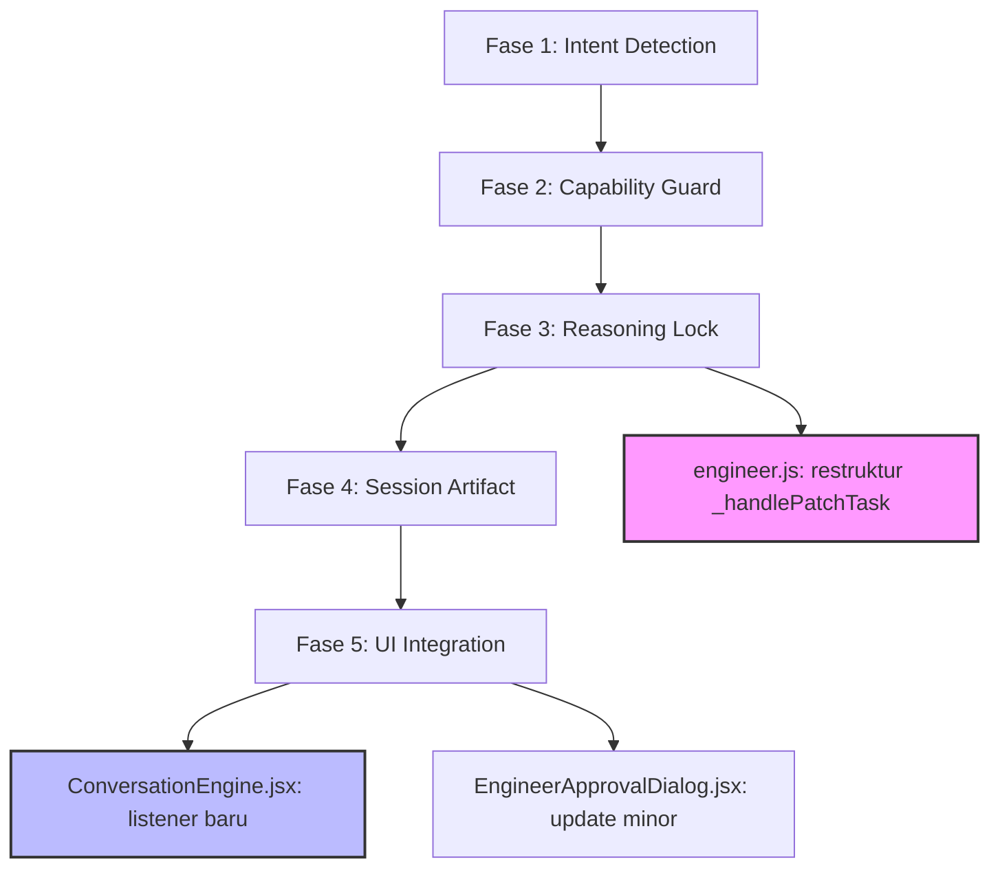

# 📋 DOKUMEN PERENCANAAN: ENGINEER SELF-MAINTENANCE PIPELINE (FASE 2)

**Versi:** 2.0.0  
**Tanggal:** 28 Juli 2026  
**Status:** Disetujui untuk Implementasi

---

## 1. Ringkasan Eksekutif

Setelah serangkaian diskusi dan debugging, kami menyepakati arsitektur baru untuk **Engineer** yang tidak hanya "pintar", tetapi juga **profesional, aman, dan memiliki pemahaman kontekstual**. 

Engineer akan berevolusi dari sekadar *tool patch generator* menjadi **AI Apprentice** yang:
- Membedakan maksud pengguna (analisis vs. eksekusi).
- Menunjukkan proses berpikirnya (*Reasoning Lock*) sebelum menyentuh kode.
- Memiliki memori sesi (*Session Artifact*) agar model AI lain dapat melanjutkan pekerjaan.
- Mengetahui batas kemampuannya dan berani mengatakan "tidak" (*Capability Guard*).
- Mematuhi aturan arsitektur (MAEF, ADR, dan batas file).

---

## 2. Arsitektur Alur Baru (Reasoning-First Pipeline)

Alur kerja Engineer kini dibagi menjadi 4 tahap utama (3 pra-eksekusi, 1 eksekusi):

| Tahap | Nama | Deskripsi |
| :--- | :--- | :--- |
| **1** | **Intent Detection** | Engineer membaca prompt user dan mengklasifikasikannya: Analisis, Ubah Kode, atau Klarifikasi. |
| **2** | **Capability & Safety Check** | Engineer memeriksa apakah permintaan berada dalam batas kemampuannya (ukuran file, kejelasan prompt, dll.). |
| **3** | **Reasoning & Planning** | Engineer melakukan analisis mendalam, menghasilkan laporan, dan **menunggu persetujuan manusia** sebelum menghasilkan kode. |
| **4** | **Execution (Granular Approval)** | Setelah disetujui, Engineer membuat patch dan menampilkan UI Approval untuk persetujuan file-per-file. |

---

## 3. Komponen Kunci & Aturan Main

### 3.1. Intent Detection (Pemahaman Tujuan)
Engineer menggunakan deteksi berbasis kata kunci untuk menentukan tujuan user. Jika ambigu, ia akan meminta klarifikasi.

- **Analisis:** `analisis`, `review`, `telaah`, `evaluasi`, `cek`, `laporan`.
- **Ubah Kode:** `ubah`, `tambah`, `hapus`, `perbaiki`, `refactor`, `implementasi`.
- **Klarifikasi:** Jika kedua kategori muncul, atau tidak ada sama sekali.

### 3.2. Reasoning Lock (Kunci Penalaran)
**Prinsip:** *Tidak ada kode yang dihasilkan tanpa analisis yang ditunjukkan.*

- Sebelum membuat patch, Engineer wajib mengirim **Laporan Reasoning** ke UI.
- Laporan berisi: Ringkasan analisis, temuan MAEF, file yang terlibat, dan rekomendasi.
- User harus memberikan persetujuan eksplisit ("Lanjutkan") untuk melanjutkan ke tahap pembuatan patch.

### 3.3. Session Artifact (Memori Konteks)
**Tujuan:** Memastikan kelangsungan penalaran saat berganti model AI.

- Setiap sesi memiliki `SessionArtifact` yang mencatat:
  - Ringkasan keputusan.
  - File yang dianalisis/diubah.
  - Pelanggaran MAEF yang ditemukan.
  - Alasan di balik setiap keputusan.
- Model AI baru akan menerima `SessionArtifact` sebagai bagian dari konteks prompt.

### 3.4. Capability Guard & Batasan Profesional
Engineer akan secara eksplisit menolak permintaan yang berada di luar batas wajar atau berisiko tinggi.

| Aspek | Aturan |
| :--- | :--- |
| **Ukuran File** | Maksimal 10 file per patch. Jika lebih, Engineer akan menyarankan *batching* (memecah tugas). |
| **ADR (Arsitektur)** | Wajib menyertakan ADR yang relevan untuk perubahan di file core/struktur. Jika tidak ada, minta arahan user. |
| **Kejelasan Prompt** | Jika prompt kurang dari 20 kata atau ambigu, minta klarifikasi. |
| **Confidence Threshold** | Jika Confidence < 70%, tidak akan membuat patch otomatis (hanya analisis). |
| **Core Protection** | Tidak akan pernah menyentuh file `Kernel.js`, `EventBus.js`, dll. (sesuai MAEF 4.2). |

### 3.5. Verifikasi & Approval
- **Laporan Reasoning:** Tidak memerlukan approval granular, hanya konfirmasi "Lanjutkan".
- **Patch Kode:** Tetap menggunakan **Granular Approval** (user memilih file mana yang akan diterapkan).

---

## 4. Antarmuka Pengguna (UI Changes)

Untuk mendukung alur baru ini, UI perlu menampilkan:

1.  **Blok Laporan Reasoning:** Tampilan khusus (bisa berupa blok chat atau widget) yang memuat:
    - Ringkasan analisis.
    - Tanda bahaya (pelanggaran MAEF).
    - Tombol **"✅ Lanjutkan"** dan **"❌ Batalkan"**.
2.  **Session Artifact Viewer:** Opsi untuk membuka ringkasan sesi (bisa di sidebar atau tombol "Lihat Log Sesi").

---

## 5. Rencana Implementasi (Langkah Pengerjaan)

Agar perubahan terstruktur, kita akan mengerjakan dalam urutan berikut:

1.  **Fase 1: Intent Detection & Klarifikasi**
    - Menambahkan method `_detectIntent()` dan logika `ASK_CLARIFICATION`.
    - Memperkaya kata kunci untuk analisis dan ubah kode.
2.  **Fase 2: Capability Guard & Pencegahan Drift**
    - Membangun `_checkCapabilityAndDeclare()`.
    - Menerapkan batas 10 file dan aturan ADR wajib.
3.  **Fase 3: Reasoning Lock & Laporan**
    - Membuat `_emitReasoningReport()` dan mekanisme `_waitForUserConfirmation()`.
    - Memisahkan alur analisis dan eksekusi di `_handlePatchTask`.
4.  **Fase 4: Session Artifact**
    - Membuat `_updateArtifact()` dan `_injectArtifactIntoPrompt()`.
    - Mengintegrasikan ke dalam `_generatePatch()`.
5.  **Fase 5: Integrasi UI & Pengujian**
    - Menambahkan event listener `Engineer:UserConfirmation` di `ConversationEngine.jsx`.
    - Membuat tombol "Lanjutkan/Batalkan" pada laporan reasoning.
    - Melakukan pengujian end-to-end dengan berbagai skenario.

---

## 6. Catatan Kritis untuk Pengembang

- **Isolasi Mode:** Pastikan `ConversationEngine.jsx` hanya mendelegasikan ke Engineer jika mode adalah `ws-engineer`. Mode lain (ASSISTANT/LITE) tetap menggunakan jalur backend.
- **Environment:** `PROJECT_ROOT` di `main.cjs` tetap menjadi batas akses file. Engineer *tidak* akan bisa mengakses folder di luar proyek Mamet OS.
- **Dokumentasi:** Setiap method baru harus memiliki JSDoc yang jelas.

---

*Dokumen ini disetujui dan menjadi panduan utama untuk pengembangan Engineer Self-Maintenance Pipeline tahap selanjutnya.*


# 📋 RENCANA IMPLEMENTASI: Engineer Self-Maintenance Pipeline (Fase 2)

**Berdasarkan:** `docs/roadmap/rencana.md`
**Project:** Mamet OS Ecosystem
**Status:** ✅ Disetujui untuk direncanakan

---

## Ringkasan Gap Analysis

Dari 5 fase rencana, komponen yang **sudah ada** vs **perlu dibangun**:

| Fase | Sudah Ada | Perlu Dibangun |
|:-----|:----------|:---------------|
| 1. Intent Detection | Parsial (implisit di ConversationEngine) | Method `_detectIntent()`, state `ASK_CLARIFICATION` |
| 2. Capability Guard | Immutable/Protected file check | Confidence threshold, ADR wajib check, prompt clarity check |
| 3. Reasoning Lock | ❌ Tidak ada | `_emitReasoningReport()`, `_waitForUserConfirmation()`, Reasoning UI |
| 4. Session Artifact | ❌ Tidak ada | Class `SessionArtifact`, `_updateArtifact()`, `_injectArtifactIntoPrompt()` |
| 5. UI Integration | Granular Approval dialog | Reasoning Block UI, Session Artifact Viewer |

---

> **Status Implementasi: ✅ SELESAI & TESTED (Fase 1-5) — 54/54 test passed + UI Integration**

## ✅ FASE 1: Intent Detection & Klarifikasi (SELESAI)

### File Target: `frontend/src/core/runtime/services/engineer.js`

**Langkah 1.1 ✅ Method `_detectIntent()`** — Sudah ditambahkan dengan:
- Keyword bilingual (Indonesia + Inggris)
- Analisis: `analisis`, `review`, `telaah`, `evaluasi`, `cek`, `analyze`, `examine`, `audit`, `diagnosa`, dll.
- Modifikasi: `ubah`, `tambah`, `hapus`, `perbaiki`, `refactor`, `change`, `add`, `remove`, `edit`, `patch`, dll.
- Return: `'ANALYSIS'`, `'MODIFY_CODE'`, `'CLARIFICATION'`, `'UNKNOWN'`

**Langkah 1.2 ✅ State `intentState`** — Ditambahkan property `this.intentState` dengan nilai:
- `'READY'`, `'ANALYZING'`, `'ASK_CLARIFICATION'`, `'PROCEEDING'`

**Langkah 1.3 ✅ Integrasi ke `_handlePatchTask()`** — Sudah diimplementasikan:
- Intent `ANALYSIS` → redirect ke `_handleAnalysisTask()`
- Intent `CLARIFICATION` → emit event `Engineer:Recommendation` dengan type `ASK_CLARIFICATION`
- Intent `MODIFY_CODE` → lanjut ke flow normal

---

## ✅ FASE 2: Capability Guard Lengkap (SELESAI)

### File Target: `frontend/src/core/runtime/services/engineer.js`

**Langkah 2.1 ✅ Method `_checkCapabilityAndDeclare(task, options)`** — Sudah ditambahkan dengan 4 checks:
1. **Prompt Clarity Check** — Minimal 20 kata (jika < 20, return reason dengan jumlah kata)
2. **File Limit Check** — Maksimal 10 file (jika > 10, suggest batching)
3. **ADR Wajib Check** — Untuk perubahan arsitektur/struktur, minta ADR
4. **Confidence Threshold Check** — Jika analysis tersedia dan evidence < 70, tolak auto-patch

**Langkah 2.2 ✅ Integrasi ke `_handlePatchTask()`** — Sudah diimplementasikan:
- Ambil model name dari BrainService untuk transparansi
- Panggil `_checkCapabilityAndDeclare()` setelah intent detection
- Jika `pass === false`, emit event `CAPABILITY_BLOCKED` dengan reason dan model name
- Jika `pass === true`, lanjut ke `_analyze()` dan `_generatePatch()`

---

## 📌 FASE 3: Reasoning Lock & Laporan (CRITICAL - Gap Terbesar)

### File Target: `frontend/src/core/runtime/services/engineer.js`

**Langkah 3.1 — Buat method `_emitReasoningReport(task, analysis)`**
- Method ini akan menghasilkan object report yang berisi:
  
```javascript
  {
    taskId: task.id,
    summary: string,              // Ringkasan analisis
    findings: string[],           // Temuan (pelanggaran MAEF, warning)
    adrReferenced: string|null,   // ADR yang dirujuk
    filesAnalyzed: string[],      // File yang dianalisis
    recommendedFiles: string[],   // File yang direkomendasikan untuk diubah
    compliance: { violations, warnings },
    confidence: { coverage, evidence, level },
    intent: string,               // Hasil intent detection
    capabilityCheck: { pass, reason }, // Hasil capability check
    recommendation: string,       // Rekomendasi akhir
    timestamp: ISO timestamp
  }
  
```
- Method ini akan **emit event `Engineer:ReasoningReport`** (bukan langsung approval)

**Langkah 3.2 — Buat method `_waitForUserConfirmation()`**
- Method ini mengembalikan Promise yang di-resolve ketika user memberikan konfirmasi
- Implementasi mirip `_requestApproval()` — menggunakan Map `pendingConfirmations`
- Emit event `Engineer:RequestConfirmation` dengan data report
- Tunggu event `Engineer:UserConfirmation` dari UI

**Langkah 3.3 — Restruktur `_handlePatchTask()`**
- Alur baru:
  1. Detect intent → `_detectIntent(task)`
  2. Check capability → `_checkCapabilityAndDeclare(task)`
  3. Analisis → `_analyze(task)`
  4. **Emit Reasoning Report** → `_emitReasoningReport(task, analysis)`
  5. **Wait for confirmation** → `_waitForUserConfirmation()`
  6. Jika user confirm → generate patch → `_generatePatch(task)`
  7. Verify → `VerificationEngine.verifyPatchEngineering()`
  8. Request approval → `_requestApproval()`
  9. Execute → `_executePatchApplication()`

### File Target: `frontend/src/components/workbench/ConversationEngine.jsx`

**Langkah 3.4 — Tambahkan listener `Engineer:ReasoningReport`**
- Di useEffect yang sudah ada, tambahkan handler untuk event baru:
  - `Engineer:ReasoningReport` → tampilkan reasoning block di chat
  - `Engineer:RequestConfirmation` → tampilkan tombol "✅ Lanjutkan" / "❌ Batalkan"
  - `Engineer:CapabilityBlocked` → tampilkan pesan kenapa tidak bisa dilanjutkan

---

## 📌 FASE 4: Session Artifact

### File Target: `frontend/src/core/runtime/services/engineer.js`

**Langkah 4.1 — Buat class `SessionArtifact` (atau inner class)**
```javascript
class SessionArtifact {
  constructor(sessionId) {
    this.sessionId = sessionId;
    this.decisions = [];      // Riwayat keputusan
    this.analyzedFiles = [];  // File yang dianalisis
    this.modifiedFiles = [];  // File yang diubah
    this.maefViolations = []; // Pelanggaran MAEF
    this.reasoningReports = []; // Riwayat report
    this.startedAt = new Date().toISOString();
    this.lastActivity = new Date().toISOString();
  }

  addDecision(decision) {
    this.decisions.push({ ...decision, timestamp: new Date().toISOString() });
    this.lastActivity = new Date().toISOString();
  }

  addAnalyzedFile(filePath) {
    if (!this.analyzedFiles.includes(filePath)) {
      this.analyzedFiles.push(filePath);
    }
  }

  addModifiedFile(filePath) {
    if (!this.modifiedFiles.includes(filePath)) {
      this.modifiedFiles.push(filePath);
    }
  }

  getSummary() {
    return {
      sessionId: this.sessionId,
      decisionsCount: this.decisions.length,
      analyzedFilesCount: this.analyzedFiles.length,
      modifiedFilesCount: this.modifiedFiles.length,
      violationsFound: this.maefViolations.length,
      duration: `${Math.round((Date.now() - new Date(this.startedAt).getTime()) / 1000)} detik`
    };
  }
}
```

**Langkah 4.2 — Tambahkan property `this.sessionArtifact` di constructor Engineer**
- Inisialisasi: `this.sessionArtifact = null`

**Langkah 4.3 — Buat method `_updateArtifact(action, data)`**
- Update artifact berdasarkan action:
  - `'ANALYSIS'` → addAnalyzedFile, addDecision
  - `'PATCH_GENERATED'` → addModifiedFile
  - `'VERIFICATION'` → addDecision (dengan hasil verifikasi)
  - `'APPROVED'` / `'REJECTED'` → addDecision

**Langkah 4.4 — Buat method `_injectArtifactIntoPrompt()`**
- Method ini mengembalikan string konteks yang bisa di-inject ke prompt LLM
- Berisi ringkasan artifact: file yang sudah dianalisis, keputusan sebelumnya, dll
- Integrasikan ke `_buildPatchPrompt()`

---

## 📌 FASE 5: UI Integration

### File Target: `frontend/src/components/workbench/ConversationEngine.jsx`

**Langkah 5.1 — Reasoning Block UI Component**
- Buat komponen baru inline atau terpisah untuk menampilkan Reasoning Report
- Elemen-elemen:
  - Header "🧠 Reasoning Analysis"
  - Ringkasan analisis
  - Daftar temuan (MAEF violations / warnings) dengan color coding
  - Confidence bar
  - Tombol **"✅ Lanjutkan ke Patch"** dan **"❌ Batalkan"**
  - Tombol "📋 Detail Lengkap" yang expand

**Langkah 5.2 — Session Artifact Viewer**
- Di sidebar atau panel terpisah
- Tampilkan:
  - Session ID
  - Jumlah file dianalisis/dimodifikasi
  - Riwayat keputusan
  - Tombol "📋 Salin Ringkasan Sesi" untuk handoff

**Langkah 5.3 — Update `EngineerApprovalDialog.jsx`**
- Tambahkan badge/banner jika reasoning lock belum dikonfirmasi
- (Atau pastikan approval hanya muncul setelah reasoning lock passed)

---

## 📊 Dependency Graph & Urutan Implementasi



**Urutan implementasi yang direkomendasikan:**
1. **Fase 1** (Intent Detection) — dasar untuk semua fase
2. **Fase 2** (Capability Guard) — safety net sebelum reasoning
3. **Fase 3** (Reasoning Lock) — perubahan arsitektur inti
4. **Fase 4** (Session Artifact) — bisa paralel dengan Fase 5
5. **Fase 5** (UI Integration) — tergantung Fase 3

---

## 📋 Total File yang Akan Diubah/Dibuat

| File | Action | Fase |
|:-----|:-------|:-----|
| `frontend/src/core/runtime/services/engineer.js` | **Modifikasi besar** — tambah: `_detectIntent`, `_checkCapabilityAndDeclare`, `_emitReasoningReport`, `_waitForUserConfirmation`, `SessionArtifact`, dll. | 1,2,3,4 |
| `frontend/src/components/workbench/ConversationEngine.jsx` | **Modifikasi** — tambah listener event baru, Reasoning Block UI, Session Artifact Viewer | 5 |
| `frontend/src/components/workbench/EngineerApprovalDialog.jsx` | **Modifikasi minor** — update untuk alignment dengan reasoning flow | 5 |

---

## 🧪 Testing Plan

Setelah implementasi, perlu testing skenario:
1. **Skenario Analisis:** "Analisis file ConversationEngine.jsx" → harus masuk ke _handleAnalysisTask, tidak ke patch flow
2. **Skenario Ambigu:** "Bantu saya dengan project" → harus minta klarifikasi
3. **Skenario Confidence Rendah:** Prompt < 20 kata → ditolak di capability check
4. **Skenario Normal:** "Tambahkan console.log di file ConversationEngine.jsx" → reasoning report → confirm → patch → approval → execute
5. **Skenario Batching:** Request menyentuh > 10 file → sarankan batching


---

## 📝 Catatan Penting Sebelum Implementasi (Dari Diskusi)

### 1. Inisialisasi Session Artifact
`SessionArtifact` harus diinisialisasi saat Engineer pertama kali dijalankan (`initialize()`), **bukan per task**. Jika diinisialisasi per task, konteks akan hilang setiap kali model AI berganti.
- **Solusi:** Tambahkan `_initializeSessionArtifact()` di dalam method `initialize()`

### 2. Transparansi Model
Saat Engineer mengeluarkan Capability Blocked atau Reasoning Report, sertakan informasi model AI yang digunakan.
- Contoh: *"Saya menggunakan model `openai/gpt-4o-mini` untuk analisis ini."*
- **Caranya:** Ambil `formattedModel` dari BrainService di awal `_handlePatchTask()` dan simpan di konteks.

### 3. Strategi Testing Bertahap
- **Setelah Fase 1 & 2:** Test skenario klarifikasi dan capability check
- **Setelah Fase 3:** Test skenario reasoning lock
- **Setelah Fase 4 & 5:** Test end-to-end

---

*Rencana ini berdasarkan analisis `docs/roadmap/rencana.md` terhadap codebase `mamet os ecosystem` per 28 Juli 2026.*
